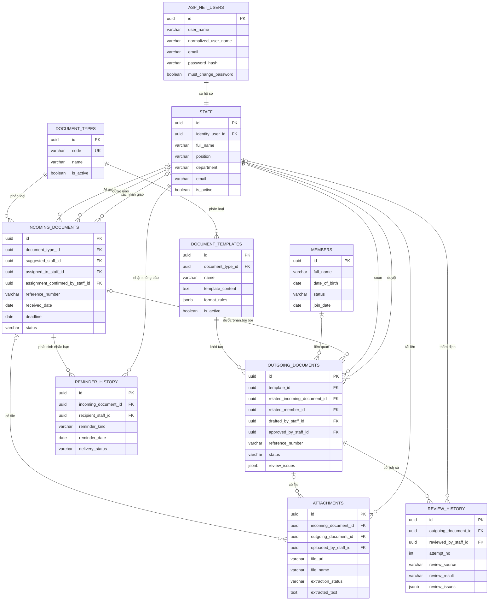
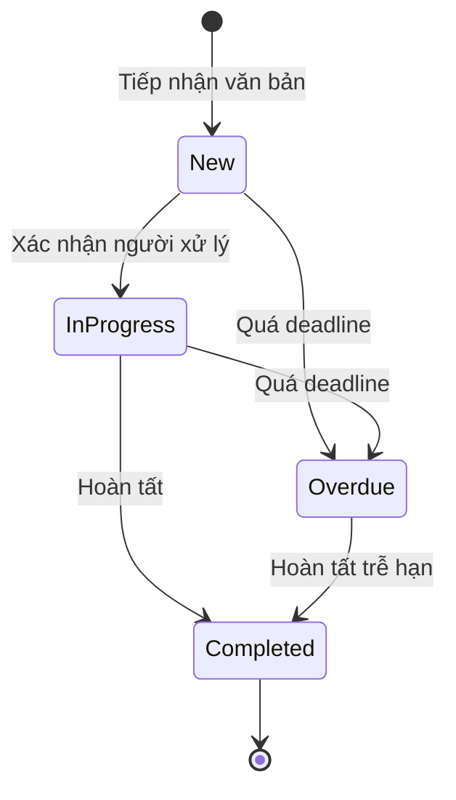
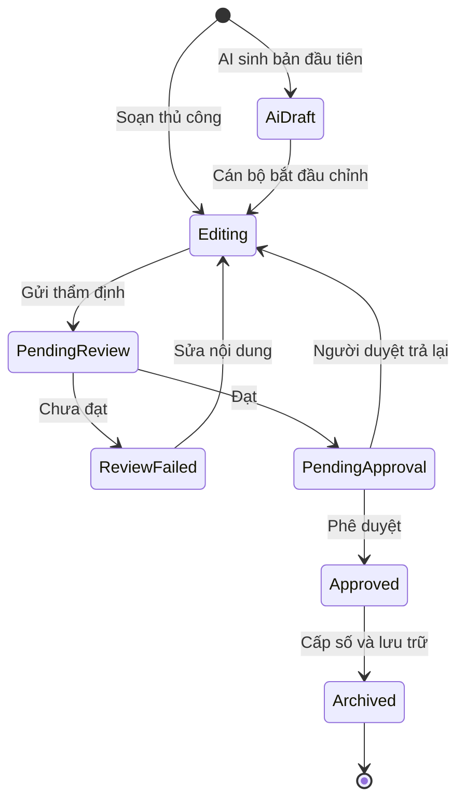

# Database Designer

## 1. Mô Tả Database

### 1.1. Mục tiêu

Database của DigitalOps phục vụ phạm vi MVP gồm:

- Quản lý hồ sơ hội viên.
- Tiếp nhận, phân loại, điều phối và nhắc hạn văn bản đến.
- Quản lý loại văn bản và mẫu văn bản.
- Soạn thảo văn bản đi với sự hỗ trợ của AI.
- Thẩm định thể thức qua nhiều vòng, phê duyệt, phát hành và lưu trữ.
- Quản lý file đính kèm dùng chung cho văn bản đến và văn bản đi, bao gồm trạng thái trích xuất text phục vụ tìm kiếm.
- Quản lý cán bộ nội bộ và liên kết với tài khoản đăng nhập ASP.NET Core Identity.

Database không quản lý file nhị phân trực tiếp. File được lưu trên local disk hoặc dịch vụ S3-compatible; database chỉ lưu đường dẫn và metadata cần thiết.

### 1.2. Công nghệ và phạm vi triển khai

| Hạng mục                  | Lựa chọn                                          |
| ------------------------- | ------------------------------------------------- |
| Hệ quản trị cơ sở dữ liệu | PostgreSQL                                        |
| Data access               | Entity Framework Core                             |
| Authentication            | ASP.NET Core Identity + JWT                       |
| Identity key              | `ApplicationUser<Guid>`                           |
| Số lượng database/schema  | Một database, một schema                          |
| Migration                 | EF Core Migration là nguồn tạo và cập nhật schema |
| Background job            | `IHostedService`/`BackgroundService` cho reminder và text extraction |

`DbContext` được đăng ký theo scoped lifetime. Background service phải tạo scope riêng khi sử dụng `DbContext`; không giữ trực tiếp scoped service bên trong singleton hosted service.

### 1.3. Quy ước đặt tên và kiểu dữ liệu

- Entity và property trong C# dùng `PascalCase`.
- Bảng và cột vật lý trong PostgreSQL dùng `snake_case`.
- Tất cả khóa chính nghiệp vụ dùng `uuid`, mặc định sinh bằng `gen_random_uuid()`.
- Ngày không kèm giờ dùng `date`.
- Thời điểm có giờ dùng `timestamptz`, lưu theo UTC.
- Chuỗi ngắn có giới hạn dùng `varchar(n)`; nội dung dài dùng `text`.
- Dữ liệu có cấu trúc linh hoạt dùng `jsonb`.
- Trạng thái lưu bằng mã tiếng Anh ổn định; giao diện ánh xạ sang nhãn tiếng Việt.
- Các bảng dữ liệu có thể chỉnh sửa dùng `created_at` và `updated_at`.

Các bảng Identity được ánh xạ sang tên `snake_case`, ví dụ `AspNetUsers` ở tầng C# tương ứng với `asp_net_users` trong PostgreSQL.

### 1.4. Danh sách bảng

| Nhóm      | Bảng                                  | Mục đích                                |
| --------- | ------------------------------------- | --------------------------------------- |
| Identity  | `asp_net_users` và các bảng liên quan | Tài khoản, mật khẩu, cờ đổi password, role, claim, token |
| Tổ chức   | `staff`                               | Hồ sơ cán bộ nội bộ                     |
| Hội viên  | `members`                             | Hồ sơ hội viên                          |
| Danh mục  | `document_types`                      | Danh mục loại văn bản                   |
| Danh mục  | `document_templates`                  | Mẫu nội dung và quy tắc thể thức        |
| Văn bản   | `incoming_documents`                  | Văn bản đến và thông tin điều phối      |
| Văn bản   | `outgoing_documents`                  | Văn bản soạn thảo, phê duyệt và lưu trữ |
| Văn bản   | `attachments`                         | Metadata file, trạng thái và text trích xuất |
| Thẩm định | `review_history`                      | Snapshot và kết quả từng lần thẩm định  |
| Nhắc hạn  | `reminder_history`                    | Thông báo nhắc hạn nội bộ               |

### 1.5. Giới hạn MVP

- Không tạo bảng `AiDraftLogs`; chỉ lưu bản AI sinh đầu tiên tại `outgoing_documents.ai_draft_content`.
- Không tạo bảng lịch sử gợi ý điều phối; chỉ lưu gợi ý AI mới nhất trên `incoming_documents`.
- Không tạo `Cases`, `MemberStatusHistory`, `AssignmentSuggestions` hoặc mô hình quản lý hội viên nâng cao.
- Một văn bản đi liên kết trực tiếp tối đa một hội viên.
- Nhắc hạn chỉ là thông báo nội bộ trong ứng dụng, chưa bao gồm email/SMS.
- Các bảng `FormatRules` và `ReviewIssues` không được chuẩn hóa thành nhiều bảng con trong MVP.
- Không OCR ảnh hoặc PDF scan trong MVP; chỉ trích xuất text từ PDF có text layer, DOCX và XLSX.

## 2. Sơ Đồ ER (Entity Relationship)



> Mermaid không biểu diễn được ràng buộc XOR của `attachments`. Database bắt buộc mỗi attachment thuộc **đúng một** trong hai bảng `incoming_documents` hoặc `outgoing_documents`.

## 3. Chi Tiết Các Bảng

### 3.1. `members` — Hồ sơ hội viên

| Thuộc tính / cột                | Kiểu PostgreSQL | Null  | Khóa / Mặc định         | Mô tả                                   |
| ------------------------------- | --------------- | ----- | ----------------------- | --------------------------------------- |
| `Id` / `id`                     | `uuid`          | Không | PK, `gen_random_uuid()` | Định danh hội viên                      |
| `FullName` / `full_name`        | `varchar(200)`  | Không |                         | Họ và tên                               |
| `DateOfBirth` / `date_of_birth` | `date`          | Có    |                         | Ngày sinh                               |
| `Gender` / `gender`             | `varchar(20)`   | Có    |                         | Mã giới tính: `Male`, `Female`, `Other` |
| `Address` / `address`           | `text`          | Có    |                         | Địa chỉ hiện tại                        |
| `Phone` / `phone`               | `varchar(30)`   | Có    |                         | Số điện thoại, không lưu kiểu số        |
| `Email` / `email`               | `varchar(254)`  | Có    |                         | Email liên hệ                           |
| `Position` / `position`         | `varchar(150)`  | Có    |                         | Chức danh trong tổ chức                 |
| `JoinDate` / `join_date`        | `date`          | Có    |                         | Ngày gia nhập                           |
| `Status` / `status`             | `varchar(20)`   | Không | `Active`                | `Active`, `Inactive`                    |
| `Notes` / `notes`               | `text`          | Có    |                         | Ghi chú nghiệp vụ                       |
| `CreatedAt` / `created_at`      | `timestamptz`   | Không | UTC hiện tại            | Thời điểm tạo                           |
| `UpdatedAt` / `updated_at`      | `timestamptz`   | Không | UTC hiện tại            | Thời điểm cập nhật gần nhất             |

Index chính:

- `ix_members_full_name` trên `full_name`.
- `ix_members_status` trên `status`.
- `ix_members_phone` trên `phone`.
- `ix_members_email` trên `email`.

### 3.2. `staff` — Hồ sơ cán bộ nội bộ

`staff` là hồ sơ nghiệp vụ, không chứa password hoặc refresh token. Dữ liệu xác thực thuộc ASP.NET Core Identity.

| Thuộc tính / cột                      | Kiểu PostgreSQL | Null  | Khóa / Mặc định         | Mô tả                                     |
| ------------------------------------- | --------------- | ----- | ----------------------- | ----------------------------------------- |
| `Id` / `id`                           | `uuid`          | Không | PK, `gen_random_uuid()` | Định danh cán bộ                          |
| `IdentityUserId` / `identity_user_id` | `uuid`          | Không | FK, UK                  | Liên kết 1–1 tới `asp_net_users.id`       |
| `FullName` / `full_name`              | `varchar(200)`  | Không |                         | Họ và tên                                 |
| `Position` / `position`               | `varchar(150)`  | Có    |                         | Chức vụ                                   |
| `Department` / `department`           | `varchar(200)`  | Có    |                         | Bộ phận công tác                          |
| `Email` / `email`                     | `varchar(254)`  | Không |                         | Email nghiệp vụ                           |
| `Phone` / `phone`                     | `varchar(30)`   | Có    |                         | Số điện thoại                             |
| `IsActive` / `is_active`              | `boolean`       | Không | `true`                  | Có được tiếp tục nhận việc/thao tác không |
| `CreatedAt` / `created_at`            | `timestamptz`   | Không | UTC hiện tại            | Thời điểm tạo                             |
| `UpdatedAt` / `updated_at`            | `timestamptz`   | Không | UTC hiện tại            | Thời điểm cập nhật gần nhất               |

Index chính:

- Unique index `ux_staff_identity_user_id` trên `identity_user_id`.
- Index `ix_staff_is_active` trên `is_active`.
- Index `ix_staff_email` trên `email`.

### 3.3. `document_types` — Danh mục loại văn bản

Ví dụ mã loại: `DECISION`, `REPORT`, `NOTICE`, `MINUTES`, `PLAN`.

| Thuộc tính / cột              | Kiểu PostgreSQL | Null  | Khóa / Mặc định         | Mô tả                          |
| ----------------------------- | --------------- | ----- | ----------------------- | ------------------------------ |
| `Id` / `id`                   | `uuid`          | Không | PK, `gen_random_uuid()` | Định danh loại văn bản         |
| `Code` / `code`               | `varchar(50)`   | Không | UK                      | Mã ổn định dùng trong code/API |
| `Name` / `name`               | `varchar(150)`  | Không |                         | Tên hiển thị                   |
| `Description` / `description` | `text`          | Có    |                         | Mô tả loại văn bản             |
| `IsActive` / `is_active`      | `boolean`       | Không | `true`                  | Có cho phép sử dụng mới không  |
| `CreatedAt` / `created_at`    | `timestamptz`   | Không | UTC hiện tại            | Thời điểm tạo                  |
| `UpdatedAt` / `updated_at`    | `timestamptz`   | Không | UTC hiện tại            | Thời điểm cập nhật gần nhất    |

Index chính:

- Unique index `ux_document_types_code` trên `code`.
- Index `ix_document_types_is_active` trên `is_active`.

### 3.4. `document_templates` — Mẫu văn bản

| Thuộc tính / cột                       | Kiểu PostgreSQL | Null  | Khóa / Mặc định         | Mô tả                             |
| -------------------------------------- | --------------- | ----- | ----------------------- | --------------------------------- |
| `Id` / `id`                            | `uuid`          | Không | PK, `gen_random_uuid()` | Định danh mẫu                     |
| `DocumentTypeId` / `document_type_id`  | `uuid`          | Không | FK                      | Loại văn bản của mẫu              |
| `Name` / `name`                        | `varchar(200)`  | Không |                         | Tên mẫu                           |
| `TemplateContent` / `template_content` | `text`          | Không |                         | Khung nội dung và placeholder     |
| `FormatRules` / `format_rules`         | `jsonb`         | Không | `{}`                    | Tập quy tắc thể thức              |
| `IsActive` / `is_active`               | `boolean`       | Không | `true`                  | Có cho phép tạo văn bản mới không |
| `CreatedAt` / `created_at`             | `timestamptz`   | Không | UTC hiện tại            | Thời điểm tạo                     |
| `UpdatedAt` / `updated_at`             | `timestamptz`   | Không | UTC hiện tại            | Thời điểm cập nhật gần nhất       |

Index chính:

- Index `ix_document_templates_document_type_id` trên `document_type_id`.
- Index `ix_document_templates_is_active` trên `is_active`.
- Unique index `ux_document_templates_type_name` trên `(document_type_id, name)`.

Ví dụ `format_rules`:

```json
{
  "version": 1,
  "rules": [
    {
      "code": "national_header",
      "required": true
    },
    {
      "code": "reference_number",
      "required": true
    },
    {
      "code": "signature_block",
      "required": true
    }
  ]
}
```

### 3.5. `incoming_documents` — Văn bản đến

| Thuộc tính / cột                                                    | Kiểu PostgreSQL | Null  | Khóa / Mặc định         | Mô tả                                                  |
| ------------------------------------------------------------------- | --------------- | ----- | ----------------------- | ------------------------------------------------------ |
| `Id` / `id`                                                         | `uuid`          | Không | PK, `gen_random_uuid()` | Định danh văn bản đến                                  |
| `ReferenceNumber` / `reference_number`                              | `varchar(100)`  | Không |                         | Số/ký hiệu của đơn vị gửi                              |
| `SenderOrg` / `sender_org`                                          | `varchar(255)`  | Không |                         | Tên đơn vị gửi                                         |
| `Summary` / `summary`                                               | `text`          | Không |                         | Trích yếu nội dung                                     |
| `ReceivedDate` / `received_date`                                    | `date`          | Không |                         | Ngày tiếp nhận                                         |
| `Deadline` / `deadline`                                             | `date`          | Không |                         | Hạn hoàn thành                                         |
| `DocumentTypeId` / `document_type_id`                               | `uuid`          | Không | FK                      | Tham chiếu `document_types`, không tham chiếu template |
| `SuggestedStaffId` / `suggested_staff_id`                           | `uuid`          | Có    | FK                      | Cán bộ được AI gợi ý gần nhất                          |
| `AssignmentSuggestionReason` / `assignment_suggestion_reason`       | `text`          | Có    |                         | Giải thích ngắn của AI                                 |
| `AssignmentConfidence` / `assignment_confidence`                    | `numeric(5,4)`  | Có    |                         | Độ tin cậy từ `0` đến `1`                              |
| `AssignmentSuggestedAt` / `assignment_suggested_at`                 | `timestamptz`   | Có    |                         | Thời điểm AI đưa ra gợi ý                              |
| `AssignedToStaffId` / `assigned_to_staff_id`                        | `uuid`          | Có    | FK                      | Cán bộ được giao xử lý cuối cùng                       |
| `AssignmentConfirmedByStaffId` / `assignment_confirmed_by_staff_id` | `uuid`          | Có    | FK                      | Cán bộ văn thư xác nhận điều phối                      |
| `AssignmentConfirmedAt` / `assignment_confirmed_at`                 | `timestamptz`   | Có    |                         | Thời điểm xác nhận                                     |
| `Status` / `status`                                                 | `varchar(30)`   | Không | `New`                   | Trạng thái xử lý                                       |
| `CompletedAt` / `completed_at`                                      | `timestamptz`   | Có    |                         | Thời điểm hoàn tất                                     |
| `CreatedAt` / `created_at`                                          | `timestamptz`   | Không | UTC hiện tại            | Thời điểm tạo                                          |
| `UpdatedAt` / `updated_at`                                          | `timestamptz`   | Không | UTC hiện tại            | Thời điểm cập nhật gần nhất                            |

Giá trị `status`:

| Mã           | Nhãn UI    | Ý nghĩa                                      |
| ------------ | ---------- | -------------------------------------------- |
| `New`        | Mới        | Đã tiếp nhận nhưng chưa xác nhận người xử lý |
| `InProgress` | Đang xử lý | Đã xác nhận người xử lý                      |
| `Completed`  | Hoàn tất   | Đã hoàn thành nghiệp vụ                      |
| `Overdue`    | Quá hạn    | Chưa hoàn thành và đã quá deadline           |

Index chính:

- Index `ix_incoming_documents_document_type_id`.
- Index `ix_incoming_documents_status_deadline` trên `(status, deadline)`.
- Index `ix_incoming_documents_assigned_status` trên `(assigned_to_staff_id, status)`.
- Index `ix_incoming_documents_reference_sender` trên `(reference_number, sender_org)`.
- Index cho ba khóa ngoại tới `staff`.
- GIN full-text index `ix_incoming_documents_summary_fts` trên `to_tsvector('simple', coalesce(summary, ''))`.

`reference_number` không đặt unique toàn cục vì số văn bản do nhiều đơn vị bên ngoài phát hành.

Boundary migration: `AddIncomingDocuments` của T2-02 tạo bảng, FK, check
constraint và các B-tree index nêu trên, ngoại trừ GIN full-text. Bảng
`attachments` thuộc T2-03; GIN `ix_incoming_documents_summary_fts` thuộc T4-02,
không nằm trong migration T2-02.

### 3.6. `outgoing_documents` — Văn bản soạn thảo/văn bản đi

| Thuộc tính / cột                                             | Kiểu PostgreSQL | Null  | Khóa / Mặc định         | Mô tả                                       |
| ------------------------------------------------------------ | --------------- | ----- | ----------------------- | ------------------------------------------- |
| `Id` / `id`                                                  | `uuid`          | Không | PK, `gen_random_uuid()` | Định danh văn bản đi                        |
| `TemplateId` / `template_id`                                 | `uuid`          | Không | FK                      | Mẫu dùng để khởi tạo                        |
| `RelatedIncomingDocumentId` / `related_incoming_document_id` | `uuid`          | Có    | FK                      | Văn bản đến được phản hồi                   |
| `RelatedMemberId` / `related_member_id`                      | `uuid`          | Có    | FK                      | Một hội viên liên quan                      |
| `Title` / `title`                                            | `varchar(500)`  | Không |                         | Tiêu đề/trích yếu                           |
| `Content` / `content`                                        | `text`          | Không |                         | Nội dung hiện tại cán bộ đang chỉnh sửa     |
| `AiDraftContent` / `ai_draft_content`                        | `text`          | Có    |                         | Bản AI sinh đầu tiên, giữ nguyên để so sánh |
| `DraftedByStaffId` / `drafted_by_staff_id`                   | `uuid`          | Không | FK                      | Cán bộ chịu trách nhiệm soạn                |
| `Status` / `status`                                          | `varchar(30)`   | Không | `Editing`               | Trạng thái quy trình                        |
| `ReviewIssues` / `review_issues`                             | `jsonb`         | Không | `[]`                    | Lỗi của lần thẩm định gần nhất              |
| `ApprovedByStaffId` / `approved_by_staff_id`                 | `uuid`          | Có    | FK                      | Cán bộ phê duyệt                            |
| `ApprovedAt` / `approved_at`                                 | `timestamptz`   | Có    |                         | Thời điểm phê duyệt                         |
| `ReferenceNumber` / `reference_number`                       | `varchar(100)`  | Có    | UK có điều kiện         | Số/ký hiệu do đơn vị phát hành              |
| `IssuedDate` / `issued_date`                                 | `date`          | Có    |                         | Ngày phát hành                              |
| `ArchivedAt` / `archived_at`                                 | `timestamptz`   | Có    |                         | Thời điểm chuyển lưu trữ                    |
| `CreatedAt` / `created_at`                                   | `timestamptz`   | Không | UTC hiện tại            | Thời điểm tạo                               |
| `UpdatedAt` / `updated_at`                                   | `timestamptz`   | Không | UTC hiện tại            | Thời điểm cập nhật gần nhất                 |

Giá trị `status`:

| Mã                | Nhãn UI        | Ý nghĩa                                   |
| ----------------- | -------------- | ----------------------------------------- |
| `AiDraft`         | Nháp AI        | AI vừa sinh bản nháp đầu tiên             |
| `Editing`         | Đang chỉnh sửa | Cán bộ đang chỉnh nội dung                |
| `PendingReview`   | Chờ thẩm định  | Đã gửi thẩm định                          |
| `ReviewFailed`    | Chưa đạt       | Lần thẩm định gần nhất chưa đạt           |
| `PendingApproval` | Chờ duyệt      | Đã đạt thẩm định                          |
| `Approved`        | Đã duyệt       | Đã được người có thẩm quyền duyệt         |
| `Archived`        | Lưu trữ        | Đã có số, ngày phát hành và được khóa sửa |

Index chính:

- Index `ix_outgoing_documents_status` trên `status`.
- Index cho `template_id`, `related_incoming_document_id`, `related_member_id`, `drafted_by_staff_id`, `approved_by_staff_id`.
- Unique partial index `ux_outgoing_documents_reference_number` trên `reference_number WHERE reference_number IS NOT NULL`.
- Index `ix_outgoing_documents_created_at` trên `created_at`.
- GIN full-text index `ix_outgoing_documents_content_fts` trên tổ hợp `title`, `content`, `ai_draft_content` qua `to_tsvector('simple', ...)`.

Ví dụ `review_issues`:

```json
[
  {
    "ruleCode": "signature_block",
    "severity": "Error",
    "message": "Thiếu khối chữ ký ở cuối văn bản.",
    "location": "Cuối văn bản"
  }
]
```

### 3.7. `attachments` — File đính kèm

Schema bên dưới là đích cuối của MVP cho cả incoming và outgoing. Migration
`AddIncomingAttachments` của T2-03 triển khai theo pha: chỉ có
`incoming_document_id NOT NULL`, chưa có `outgoing_document_id`; T3-01 sẽ đổi
incoming FK thành nullable, thêm outgoing FK và check đúng một parent khi bảng
`outgoing_documents` được triển khai. Cách chia pha này tránh tạo sớm persistence
văn bản đi chỉ để thỏa một FK chưa sử dụng.

| Thuộc tính / cột                              | Kiểu PostgreSQL | Null  | Khóa / Mặc định         | Mô tả                     |
| --------------------------------------------- | --------------- | ----- | ----------------------- | ------------------------- |
| `Id` / `id`                                   | `uuid`          | Không | PK, `gen_random_uuid()` | Định danh file            |
| `IncomingDocumentId` / `incoming_document_id` | `uuid`          | Có    | FK                      | Văn bản đến sở hữu file   |
| `OutgoingDocumentId` / `outgoing_document_id` | `uuid`          | Có    | FK                      | Văn bản đi sở hữu file    |
| `FileUrl` / `file_url`                        | `varchar(2048)` | Không |                         | Đường dẫn hoặc object key |
| `FileName` / `file_name`                      | `varchar(255)`  | Không |                         | Tên file hiển thị         |
| `UploadedByStaffId` / `uploaded_by_staff_id`  | `uuid`          | Không | FK                      | Người tải file lên        |
| `ExtractionStatus` / `extraction_status`      | `varchar(20)`   | Không | `Pending`               | Trạng thái trích xuất text |
| `ExtractedText` / `extracted_text`            | `text`          | Có    |                         | Nội dung text trích xuất để tìm kiếm |
| `ExtractionError` / `extraction_error`        | `text`          | Có    |                         | Lỗi kỹ thuật gần nhất khi trích xuất |
| `ExtractedAt` / `extracted_at`                | `timestamptz`   | Có    |                         | Thời điểm trích xuất hoàn tất |
| `UploadedAt` / `uploaded_at`                  | `timestamptz`   | Không | UTC hiện tại            | Thời điểm tải lên         |
| `UpdatedAt` / `updated_at`                    | `timestamptz`   | Không | UTC hiện tại            | Thời điểm cập nhật extraction/metadata |

Index chính:

- Index `ix_attachments_incoming_document_id`.
- Index `ix_attachments_outgoing_document_id`.
- Index `ix_attachments_uploaded_by_staff_id`.
- Index `ix_attachments_extraction_status` trên `extraction_status`.
- GIN full-text index `ix_attachments_extracted_text_fts` trên
  `to_tsvector('simple', coalesce(extracted_text, ''))` được tạo ở T4-02, sau
  khi Text Extraction Worker T4-01 đã hoàn tất.

Database không lưu dữ liệu binary. `extracted_text` chỉ lưu text được trích xuất từ PDF có text layer, DOCX và XLSX; ảnh/PDF scan không OCR trong MVP. Khi xóa một attachment hợp lệ, service phải xóa object/file và bản ghi database theo một quy trình có xử lý lỗi.

### 3.8. `review_history` — Lịch sử thẩm định

Mỗi lần chạy thẩm định tạo đúng một dòng mới. Dữ liệu đã ghi không được sửa hoặc xóa trong nghiệp vụ thông thường.

| Thuộc tính / cột                              | Kiểu PostgreSQL | Null  | Khóa / Mặc định         | Mô tả                                       |
| --------------------------------------------- | --------------- | ----- | ----------------------- | ------------------------------------------- |
| `Id` / `id`                                   | `uuid`          | Không | PK, `gen_random_uuid()` | Định danh lần thẩm định                     |
| `OutgoingDocumentId` / `outgoing_document_id` | `uuid`          | Không | FK                      | Văn bản được thẩm định                      |
| `AttemptNo` / `attempt_no`                    | `integer`       | Không | UK theo văn bản         | Số lần thẩm định, bắt đầu từ `1`            |
| `ReviewSource` / `review_source`              | `varchar(20)`   | Không |                         | `Rule`, `AI`, `Hybrid`                      |
| `ReviewedByStaffId` / `reviewed_by_staff_id`  | `uuid`          | Có    | FK                      | Người thẩm định; null nếu hoàn toàn tự động |
| `ContentSnapshot` / `content_snapshot`        | `text`          | Không |                         | Snapshot nội dung tại thời điểm kiểm tra    |
| `ReviewResult` / `review_result`              | `varchar(20)`   | Không |                         | `Failed`, `Passed`                          |
| `ReviewIssues` / `review_issues`              | `jsonb`         | Không | `[]`                    | Danh sách lỗi tại lần này                   |
| `ReviewedAt` / `reviewed_at`                  | `timestamptz`   | Không | UTC hiện tại            | Thời điểm thẩm định                         |

Index chính:

- Unique index `ux_review_history_document_attempt` trên `(outgoing_document_id, attempt_no)`.
- Index `ix_review_history_document_reviewed_at` trên `(outgoing_document_id, reviewed_at DESC)`.
- Index `ix_review_history_reviewed_by_staff_id`.

### 3.9. `reminder_history` — Lịch sử nhắc hạn

Mỗi dòng là một thông báo nội bộ dành cho cán bộ được giao xử lý văn bản đến.

| Thuộc tính / cột                              | Kiểu PostgreSQL | Null  | Khóa / Mặc định         | Mô tả                                  |
| --------------------------------------------- | --------------- | ----- | ----------------------- | -------------------------------------- |
| `Id` / `id`                                   | `uuid`          | Không | PK, `gen_random_uuid()` | Định danh thông báo                    |
| `IncomingDocumentId` / `incoming_document_id` | `uuid`          | Không | FK                      | Văn bản phát sinh nhắc hạn             |
| `RecipientStaffId` / `recipient_staff_id`     | `uuid`          | Không | FK                      | Cán bộ nhận thông báo                  |
| `ReminderKind` / `reminder_kind`              | `varchar(30)`   | Không |                         | `BeforeDeadline`, `DueDate`, `Overdue` |
| `ReminderDate` / `reminder_date`              | `date`          | Không |                         | Ngày nghiệp vụ của thông báo           |
| `DeliveryStatus` / `delivery_status`          | `varchar(20)`   | Không | `Unread`                | `Unread`, `Read`                       |
| `CreatedAt` / `created_at`                    | `timestamptz`   | Không | UTC hiện tại            | Thời điểm tạo thông báo                |
| `ReadAt` / `read_at`                          | `timestamptz`   | Có    |                         | Thời điểm người nhận đọc               |

Index chính:

- Unique index `ux_reminder_history_idempotency` trên `(incoming_document_id, recipient_staff_id, reminder_kind, reminder_date)`.
- Index `ix_reminder_history_recipient_status` trên `(recipient_staff_id, delivery_status, created_at DESC)`.
- Index `ix_reminder_history_incoming_document_id`.

### 3.10. Các bảng ASP.NET Core Identity

Nhóm bảng Identity do framework quản lý:

- `asp_net_users`
- `asp_net_roles`
- `asp_net_user_roles`
- `asp_net_user_claims`
- `asp_net_role_claims`
- `asp_net_user_logins`
- `asp_net_user_tokens`

`ApplicationUser` sử dụng `Guid` làm khóa chính. `staff.identity_user_id` là unique FK đến `asp_net_users.id`. Role/claim dùng cho phân quyền; không lưu role trực tiếp trong `staff`.

Ngoài các cột do ASP.NET Core Identity quản lý, `ApplicationUser` bổ sung property sau:

| Property / cột | Kiểu PostgreSQL | Null | Mặc định | Mô tả |
| --- | --- | --- | --- | --- |
| `MustChangePassword` / `must_change_password` | `boolean` | Không | `false` | Chỉ cho phép đổi mật khẩu/đăng xuất khi cờ là `true` |

## 4. Quy Tắc Dữ Liệu Theo Bảng (DB Rule)

### 4.1. Quy tắc chung

1. Mọi thời điểm ghi vào database phải là UTC. Deadline dạng ngày được đánh giá theo timezone nghiệp vụ cấu hình cho hệ thống, mặc định `Asia/Ho_Chi_Minh`.
2. Mọi cột `updated_at` phải được cập nhật khi aggregate thay đổi.
3. Foreign key lịch sử sử dụng `RESTRICT`/`NO ACTION`; không cascade delete hồ sơ nghiệp vụ.
4. `members`, `staff`, `document_types` và `document_templates` đã được tham chiếu không được xóa cứng; dùng `status` hoặc `is_active`.
5. Entity EF Core không được dùng trực tiếp làm DTO/API contract.
6. Các thay đổi liên quan nhiều bảng phải chạy trong cùng transaction.
7. Text Extraction Worker cập nhật `attachments` trong scope database riêng; việc trích xuất không được giữ request upload chờ hoàn tất.
8. Full-text search dùng PostgreSQL `simple` text-search configuration; service API thực hiện phân trang, filter và kiểm tra quyền trước khi trả kết quả/snippet.

### 4.2. Quy tắc `members`

- `status IN ('Active', 'Inactive')`.
- Chỉ hội viên `Active` được chọn cho văn bản mới.
- Chuyển `Inactive` không làm mất liên kết tới các văn bản lịch sử.
- `phone` là chuỗi để giữ số `0` đầu và ký tự định dạng.

### 4.3. Quy tắc `staff` và Identity

- `identity_user_id` bắt buộc và unique.
- Một tài khoản Identity chỉ có tối đa một hồ sơ `staff`.
- Password, security stamp, refresh token và dữ liệu xác thực không được lưu trong `staff`.
- `must_change_password` mặc định `false`; tạo mới hoặc reset mật khẩu đặt thành `true`; đổi mật khẩu thành công đặt lại `false`.
- Khi `must_change_password = true`, application chỉ cho phép endpoint đổi mật khẩu hoặc đăng xuất; các endpoint nghiệp vụ phải từ chối.
- `staff.is_active = false` phải chặn đăng nhập kể cả khi Identity user vẫn tồn tại.
- Chỉ cán bộ `is_active = true` được gợi ý, nhận điều phối, soạn, thẩm định hoặc duyệt dữ liệu mới.
- Vô hiệu hóa cán bộ không làm thay đổi các khóa ngoại lịch sử.

### 4.4. Quy tắc `document_types` và `document_templates`

- `document_types.code` là mã ổn định, không dùng tên hiển thị làm điều kiện nghiệp vụ.
- `document_templates` unique theo `(document_type_id, name)`.
- Chỉ type/template `is_active = true` được dùng để tạo dữ liệu mới.
- Template đã được tham chiếu không bị xóa; nội dung văn bản đã tạo nằm riêng tại `outgoing_documents.content`.
- `jsonb_typeof(format_rules) = 'object'`.
- Service yêu cầu `version` là số nguyên dương và `rules` là mảng; mỗi rule có
  `code` không rỗng, không trùng sau khi trim (phân biệt hoa/thường) và
  `required` là boolean. Thuộc tính mở rộng được phép; database chỉ đảm bảo JSON
  hợp lệ và root là object.
- Vô hiệu hóa type không cascade `is_active` của template. Template active chỉ
  được coi là khả dụng cho dữ liệu mới khi type cha cũng active.

### 4.5. Quy tắc `incoming_documents`

Các check constraint bắt buộc:

```sql
status IN ('New', 'InProgress', 'Completed', 'Overdue')
```

```sql
received_date <= deadline
```

```sql
assignment_confidence IS NULL
OR assignment_confidence BETWEEN 0 AND 1
```

Gợi ý AI phải thỏa một trong hai trạng thái:

- Chưa có gợi ý: toàn bộ `suggested_staff_id`, `assignment_suggestion_reason`, `assignment_confidence`, `assignment_suggested_at` là null.
- Đã có gợi ý: `suggested_staff_id` và `assignment_suggested_at` khác null; lý do và confidence có thể null nếu AI provider không trả về.

Xác nhận điều phối phải thỏa một trong hai trạng thái:

- Chưa xác nhận: `assigned_to_staff_id`, `assignment_confirmed_by_staff_id`, `assignment_confirmed_at` đều null.
- Đã xác nhận: cả ba trường đều khác null.

Quy tắc hoàn tất:

- `status = 'Completed'` thì `completed_at` bắt buộc khác null.
- Các trạng thái khác thì `completed_at` phải null.
- Khi deadline đã qua và văn bản chưa hoàn tất, background worker chuyển trạng thái sang `Overdue`.
- Văn bản `Completed` không phát sinh thêm nhắc hạn.
- Chạy lại AI chỉ thay thế bộ gợi ý mới nhất; không tạo bảng history trong MVP.
- T2-02 chỉ tạo/sửa dữ liệu hành chính và hoàn tất. Task này không tự chuyển
  `New`/`InProgress` sang `Overdue`; Reminder Worker của T2-05 thực hiện việc đó.
- Khi loại hiện tại bị vô hiệu hóa, vẫn được sửa trường hành chính khác; create
  hoặc đổi `document_type_id` chỉ nhận loại active.

### 4.6. Quy tắc `outgoing_documents`

Các check constraint bắt buộc:

```sql
status IN (
  'AiDraft',
  'Editing',
  'PendingReview',
  'ReviewFailed',
  'PendingApproval',
  'Approved',
  'Archived'
)
```

```sql
jsonb_typeof(review_issues) = 'array'
```

Người duyệt và thời điểm duyệt phải cùng null hoặc cùng khác null:

```sql
(approved_by_staff_id IS NULL AND approved_at IS NULL)
OR
(approved_by_staff_id IS NOT NULL AND approved_at IS NOT NULL)
```

Số phát hành và ngày phát hành phải cùng null hoặc cùng khác null:

```sql
(reference_number IS NULL AND issued_date IS NULL)
OR
(reference_number IS NOT NULL AND issued_date IS NOT NULL)
```

Quy tắc trạng thái:

- `AiDraft` yêu cầu `ai_draft_content` khác null.
- `PendingApproval`, `Approved` và `Archived` yêu cầu lần `review_history` gần nhất có kết quả `Passed`.
- `Approved` và `Archived` yêu cầu `approved_by_staff_id`, `approved_at` khác null.
- `Archived` yêu cầu `reference_number`, `issued_date`, `archived_at` khác null.
- Ngoài trạng thái `Archived`, `archived_at` phải null.
- `Archived` là trạng thái cuối và không cho sửa nội dung.
- `ai_draft_content` chỉ được ghi khi sinh bản AI đầu tiên, không cập nhật theo các lần cán bộ sửa `content`.
- Mỗi lần review phải thêm `review_history` và cập nhật `status`, `review_issues`, `updated_at` trong cùng transaction.

### 4.7. Quy tắc `attachments`

Trong migration T2-03, mỗi attachment bắt buộc thuộc một incoming document.
Khi T3-01 bổ sung parent outgoing, mỗi attachment phải thuộc đúng một tài liệu:

```sql
num_nonnulls(incoming_document_id, outgoing_document_id) = 1
```

Ngoài ra:

- `file_url` lưu đường dẫn tương đối hoặc object key do storage service quản lý; không tin cậy URL do client tự gửi.
- T2-03 dùng local disk ngoài web root qua storage abstraction, object key sinh
  từ document/attachment GUID; tên file người dùng chỉ dùng làm tên hiển thị.
- Không cascade delete attachment khi xóa tài liệu.
- Chỉ cho xóa attachment qua service để có thể đồng bộ với file/object thực tế.
- `extraction_status IN ('Pending', 'Processing', 'Succeeded', 'Failed', 'Unsupported')`.
- `Succeeded` yêu cầu `extracted_at` khác null; `Failed` yêu cầu `extraction_error` khác null.
- PDF, DOCX và XLSX được tạo với `Pending`; worker chuyển PDF scan không có text sang `Unsupported`. Ảnh được tạo trực tiếp với `Unsupported` trong MVP.
- Extraction lỗi hoặc unsupported không ngăn upload/download; `extracted_text` không chứa dữ liệu nhạy cảm ngoài nội dung có thể tìm được từ file gốc.
- Search API chỉ trả snippet/highlight; không trả toàn bộ `extracted_text` như một field mặc định.

### 4.8. Quy tắc `review_history`

- `attempt_no > 0`.
- `review_source IN ('Rule', 'AI', 'Hybrid')`.
- `review_result IN ('Failed', 'Passed')`.
- `jsonb_typeof(review_issues) = 'array'`.
- Unique `(outgoing_document_id, attempt_no)`.
- `attempt_no` được tăng tuần tự trong transaction để tránh hai lần review nhận cùng số.
- `Passed` không được chứa issue có `severity = 'Error'`; đây là semantic rule tại application service.
- Bản ghi lịch sử là immutable.

### 4.9. Quy tắc `reminder_history`

- `reminder_kind IN ('BeforeDeadline', 'DueDate', 'Overdue')`.
- `delivery_status IN ('Unread', 'Read')`.
- `Read` yêu cầu `read_at` khác null; `Unread` yêu cầu `read_at` là null.
- Unique `(incoming_document_id, recipient_staff_id, reminder_kind, reminder_date)` bảo đảm idempotency.
- Với nhắc `Overdue`, worker có thể tạo một thông báo mới mỗi ngày vì `reminder_date` khác nhau.
- Background worker chỉ tạo nhắc cho văn bản đã có `assigned_to_staff_id` và chưa `Completed`.

### 4.10. Quy tắc xóa và cập nhật quan hệ

| Quan hệ                                     | Delete behavior |
| ------------------------------------------- | --------------- |
| `asp_net_users` → `staff`                   | `RESTRICT`      |
| `document_types` → `document_templates`     | `RESTRICT`      |
| `document_types` → `incoming_documents`     | `RESTRICT`      |
| `document_templates` → `outgoing_documents` | `RESTRICT`      |
| `members` → `outgoing_documents`            | `RESTRICT`      |
| `incoming_documents` → `outgoing_documents` | `RESTRICT`      |
| `staff` → các vai trò trên văn bản          | `RESTRICT`      |
| Văn bản → `attachments`                     | `RESTRICT`      |
| Văn bản → history                           | `RESTRICT`      |

## 5. Luồng Nghiệp Vụ Chính

### 5.1. Quản lý hội viên

1. Cán bộ tạo mới hoặc import danh sách hội viên.
2. Service chuẩn hóa khoảng trắng, email và số điện thoại trước khi lưu.
3. Hội viên được tìm kiếm theo họ tên, điện thoại, email và trạng thái.
4. Khi ngừng hoạt động, cập nhật `status = 'Inactive'`; không xóa hồ sơ.
5. Văn bản lịch sử vẫn giữ `related_member_id` sau khi hội viên ngừng hoạt động.

### 5.2. Tiếp nhận, điều phối và nhắc hạn văn bản đến



Luồng dữ liệu:

1. Văn thư nhập số hiệu, đơn vị gửi, trích yếu, ngày nhận, deadline và loại văn bản.
2. File scan được lưu tại storage; metadata thêm vào `attachments`.
3. AI phân tích trích yếu/loại văn bản và cập nhật gợi ý mới nhất:
   - `suggested_staff_id`
   - `assignment_suggestion_reason`
   - `assignment_confidence`
   - `assignment_suggested_at`
4. Văn thư có thể chọn đúng người AI gợi ý hoặc chọn người khác.
5. Khi xác nhận, hệ thống ghi `assigned_to_staff_id`, người xác nhận, thời điểm xác nhận và chuyển sang `InProgress`.
6. Background worker định kỳ:
   - Tạo `BeforeDeadline` theo cấu hình số ngày báo trước.
   - Tạo `DueDate` vào đúng deadline.
   - Chuyển văn bản đang mở sang `Overdue` khi quá hạn.
   - Tạo `Overdue` theo ngày cho tới khi hoàn tất.
7. Unique index của `reminder_history` giúp worker chạy lại mà không tạo thông báo trùng.
8. Khi hoàn tất, hệ thống chuyển `Completed`, ghi `completed_at` và ngừng nhắc.

### 5.3. Soạn thảo, thẩm định, phê duyệt và lưu trữ



Luồng dữ liệu:

1. Cán bộ chọn một `document_template`.
2. Hệ thống tạo `outgoing_documents`, có thể liên kết một văn bản đến và một hội viên.
3. Placeholder trong template được thay bằng dữ liệu hội viên/văn bản liên quan.
4. Nếu dùng AI:
   - Lần sinh đầu tiên ghi cùng nội dung vào `ai_draft_content` và `content`.
   - Trạng thái chuyển `AiDraft`.
   - Các lần cán bộ sửa chỉ cập nhật `content`.
5. Khi gửi thẩm định, chuyển `PendingReview`.
6. Service thẩm định lấy `format_rules` từ template và kiểm tra theo rule/AI.
7. Trong một transaction:
   - Xác định `attempt_no` kế tiếp.
   - Chụp `content` vào `content_snapshot`.
   - Thêm một dòng `review_history`.
   - Ghi lỗi gần nhất vào `outgoing_documents.review_issues`.
   - Chuyển `ReviewFailed` nếu chưa đạt hoặc `PendingApproval` nếu đạt.
8. Nếu chưa đạt, cán bộ sửa nội dung và gửi thẩm định lại. Chuỗi lịch sử cho phép xem rõ `Failed → sửa → Passed`.
9. Người duyệt chỉ có thể duyệt khi lần review gần nhất là `Passed`.
10. Khi duyệt, ghi `approved_by_staff_id`, `approved_at` và chuyển `Approved`.
11. Khi cấp số/phát hành, ghi đồng thời `reference_number` và `issued_date`.
12. Khi lưu trữ, ghi `archived_at`, chuyển `Archived` và khóa chỉnh sửa nội dung.

### 5.4. Quản lý file đính kèm

1. Client gửi file tới API.
2. API kiểm tra quyền, loại file, kích thước và tên file.
3. Storage service sinh đường dẫn/object key an toàn và lưu file.
4. API thêm một dòng `attachments`, gắn đúng một trong hai khóa ngoại văn bản.
5. Với PDF có text layer, DOCX và XLSX, API đặt `extraction_status = Pending`; Text Extraction Worker xử lý nền và cập nhật `extracted_text`, status, lỗi/thời điểm tương ứng.
6. Với ảnh hoặc PDF scan không có text, worker đánh dấu `Unsupported`; upload vẫn thành công.
7. Khi tải xuống, API kiểm tra quyền truy cập tài liệu trước khi trả file hoặc signed URL.
8. Khi xóa, service xử lý đồng bộ file/object và metadata; lỗi một phía phải được ghi log và có khả năng retry.

Boundary T2-03: PDF/DOCX/XLSX dừng ở trạng thái `Pending`, ảnh ở
`Unsupported`; trạng thái `Pending` trong database là hàng đợi bền vững cho
worker T4-01. Không có worker, OCR, outgoing attachment hoặc GIN index trong
task này.

### 5.5. Trích xuất text và tìm kiếm toàn văn

1. API tìm kiếm nhận từ khóa và filter, sau đó tìm theo GIN full-text index của `incoming_documents`, `outgoing_documents` và `attachments`.
2. Kết quả từ attachment được ánh xạ về incoming/outgoing document sở hữu để người dùng mở đúng hồ sơ.
3. Mỗi kết quả trả loại tài liệu, id, nguồn khớp, snippet và score; service dùng `ts_headline`/`ts_rank` hoặc tương đương.
4. Các attachment Pending, Processing, Failed hoặc Unsupported không trả match theo nội dung file.
5. Không OCR trong MVP, nên nội dung ảnh/PDF scan không thể tìm thấy qua text search.

### 5.6. Transaction boundary bắt buộc

Các thao tác sau phải atomic:

- Xác nhận điều phối và chuyển trạng thái văn bản đến.
- Hoàn tất văn bản đến và dừng phát sinh nhắc hạn mới.
- Ghi `review_history` cùng cập nhật trạng thái/lỗi gần nhất của văn bản đi.
- Phê duyệt văn bản và ghi người/thời điểm duyệt.
- Cấp số, ngày phát hành và chuyển trạng thái lưu trữ.
- Cập nhật kết quả extraction gồm status, text/error, timestamp của một attachment.
