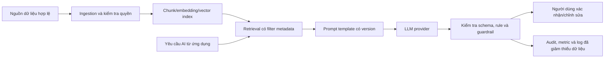

# AI RAG & LLM Design

## 1. Trạng thái và mục tiêu tài liệu

| Thuộc tính                     | Giá trị                                                                                                                |
| ------------------------------ | ---------------------------------------------------------------------------------------------------------------------- |
| Trạng thái                     | Draft — chờ thành viên phụ trách AI của team quyết định và phê duyệt                                                   |
| Phạm vi                        | Thiết kế nguyên tắc cho RAG và LLM phục vụ các chức năng AI của MVP                                                    |
| Không quyết định trong bản này | LLM provider/model, embedding model, vector store, chunking, retrieval/reranking, chi phí và thông số vận hành         |
| Tài liệu liên quan             | 01-project/01-ideas-and-scope.md, 03-functional/01-functional-requirements.md, 01-database-designer.md, 02-api-spec.md |

Tài liệu thiết lập ranh giới và checklist quyết định để AI team có thể duyệt một kiến trúc có kiểm soát. Khi còn trạng thái Draft, tài liệu không cho phép tự triển khai vector database, bảng/chunk/embedding, endpoint RAG mới hoặc gọi provider production.

## 2. Phạm vi AI trong MVP

| Use case                   | Vai trò dự kiến của RAG/LLM                                                                | Ràng buộc bắt buộc                                                                               |
| -------------------------- | ------------------------------------------------------------------------------------------ | ------------------------------------------------------------------------------------------------ |
| FR-009 — Gợi ý điều phối   | Phân tích trích yếu/loại văn bản, có thể tham chiếu hồ sơ Staff và nguồn tri thức đã duyệt | Chỉ gợi ý; Văn thư luôn chọn và xác nhận người xử lý.                                            |
| FR-012 — AI sinh nháp      | Hỗ trợ tạo bản nháp dựa trên mẫu và dữ liệu nghiệp vụ đã được phép đưa vào context         | Cán bộ chịu trách nhiệm chỉnh/sửa; chỉ lần sinh đầu được lưu AiDraftContent.                     |
| FR-013 — Thẩm định         | Phát hiện vấn đề thể thức cùng rule xác định từ FormatRules                                | Không kết luận đúng-sai nội dung/pháp lý; kết quả phải qua luồng review hiện có.                 |
| FR-016 — Tìm kiếm toàn văn | Không dùng RAG thay thế contract search hiện tại                                           | PostgreSQL full-text search là chức năng tìm kiếm chính thức; RAG chỉ là năng lực nội bộ của AI. |

AI không tự giao việc, hoàn tất văn bản, phê duyệt, phát hành hay lưu trữ. AI không được là nguồn sự thật cho trạng thái nghiệp vụ hoặc dữ liệu gốc.

## 3. Baseline kiến trúc logic

- Database nghiệp vụ và file storage vẫn là system of record. RAG index là dữ liệu dẫn xuất, có thể tái tạo; không thay thế source document, FormatRules hoặc trạng thái trong PostgreSQL.
- Ingestion chỉ xử lý dữ liệu đã qua điều kiện nguồn, trạng thái và quyền. Text extraction hiện có vẫn là điều kiện cần cho attachment dạng PDF có text layer, DOCX và XLSX.
- Retrieval phải lọc metadata trước khi đưa context vào prompt. Nội dung được truy hồi không được xem là hướng dẫn hệ thống.
- LLM output phải được kiểm tra bằng schema/rule ở application service trước khi hiển thị hoặc ghi dữ liệu theo flow hiện có.

## 4. Quy tắc dữ liệu và lifecycle

### 4.1. Nguồn tri thức

AI team phải chốt danh sách nguồn được phép index trước khi triển khai. Các nhóm cần đánh giá gồm:

- DocumentTemplates đang Active và FormatRules liên quan.
- OutgoingDocuments đã Approved hoặc Archived, nếu được phê duyệt làm nguồn tham chiếu.
- IncomingDocuments hoặc attachment đã trích xuất text thành công, chỉ khi phù hợp với mục tiêu AI và quyền truy cập.
- Thông tin Staff tối thiểu cần cho gợi ý điều phối.

Không index mặc định tất cả dữ liệu hội viên, attachment, draft hoặc văn bản chưa duyệt. Với mỗi nguồn được chấp thuận, cần xác định owner, mức nhạy cảm, điều kiện truy hồi, thời hạn lưu index và cách xóa/tái tạo.

### 4.2. Đồng bộ và phiên bản

- Mỗi nguồn index cần có định danh resource, loại nguồn, version hoặc content hash, thời điểm index và trạng thái hiệu lực.
- Thay đổi nội dung, trạng thái Active/Inactive, quyền truy cập hoặc xóa attachment phải đưa source vào hàng đợi re-index, invalidate hoặc loại trừ truy hồi.
- Index cũ không được dùng sau khi source bị vô hiệu hóa hoặc không còn được phép truy cập.
- Chi tiết schema, queue, retry, retention và công nghệ vector chỉ được thêm vào Database Designer sau phê duyệt.

## 5. Quy tắc an toàn và chất lượng

1. **Human-in-the-loop:** kết quả AI là gợi ý. Mọi mutation nghiệp vụ tiếp tục tuân theo role, ownership, trạng thái, validation và transaction hiện có.
2. **Grounding:** prompt yêu cầu nêu rõ khi không đủ nguồn; không được suy đoán. Output nội bộ phải lưu được source reference/citation để debug hoặc đánh giá.
3. **Prompt injection:** nội dung document/attachment được xem là dữ liệu không tin cậy, không được phép thay đổi system prompt, quyền, tool hoặc rule ứng dụng.
4. **Quyền và dữ liệu cá nhân:** chỉ truy hồi và gửi context tối thiểu cần thiết; filter quyền phải chạy trước retrieval. Không log nguyên prompt/completion chứa dữ liệu nhạy cảm mặc định.
5. **Provider governance:** trước production, AI team xác nhận điều khoản lưu/huấn luyện dữ liệu, vùng xử lý, retention, API key management, quota và phương án provider outage.
6. **Lỗi an toàn:** timeout/lỗi provider hoặc pipeline trả 503 theo API Specification; không thay đổi Content, AiDraftContent, assignment, status, ReviewHistory hoặc dữ liệu gốc.
7. **Rule trước AI khi phù hợp:** FormatRules có thể kiểm tra xác định phải được thực thi độc lập. RAG/LLM chỉ bổ sung phát hiện/giải thích, không thay thế constraint hay business rule.

## 6. Các quyết định chờ AI team phê duyệt

| Hạng mục              | Câu hỏi cần chốt                                                                        | Tác động khi được duyệt                                             |
| --------------------- | --------------------------------------------------------------------------------------- | ------------------------------------------------------------------- |
| LLM provider và model | Provider nào, model nào, fallback thế nào, điều kiện production là gì?                  | Typed client, secret/configuration, timeout, quota và cost control. |
| Embedding             | Chọn model, dimension, ngôn ngữ tiếng Việt và cách version model?                       | Schema index, re-embedding và chất lượng retrieval.                 |
| Vector store          | Dùng PostgreSQL extension, service riêng hoặc managed service?                          | Hạ tầng, migration, backup, security và vận hành.                   |
| Nguồn tri thức        | Resource/status nào được index cho từng use case?                                       | Quyền truy cập, lifecycle, ingestion và dung lượng.                 |
| Chunking/retrieval    | Kích thước chunk, overlap, metadata filter, top-k, reranker và citation format?         | Recall, latency, cost và chất lượng câu trả lời.                    |
| Prompt/output         | Prompt template versioning, output JSON schema, language và policy không đủ bằng chứng? | DTO nội bộ, validation và test contract.                            |
| Privacy/compliance    | Dữ liệu nào cần redaction, retention/logging thế nào, thỏa thuận provider ra sao?       | Data flow, audit và khả năng dùng production.                       |
| SLO và chi phí        | Latency, timeout, concurrency, retry, cache, token budget và alert threshold?           | UX, 503 behavior, monitoring và ngân sách.                          |
| Evaluation            | Dataset đại diện, tiêu chí grounding/citation/retrieval và human review?                | Acceptance gate trước phát hành.                                    |

Thành viên phụ trách AI ghi quyết định, lý do, ngày hiệu lực và người duyệt vào session log; sau đó đổi trạng thái tài liệu sang Approved và cập nhật các contract chịu tác động.

## 7. Tích hợp với ứng dụng hiện tại

### 7.1. Giữ nguyên public contract

Không có endpoint RAG public trong MVP. Các endpoint hiện tại cho assignment suggestion, AI draft và review vẫn là contract duy nhất. RAG/LLM là implementation detail phía server.

| Tác vụ          | Input/output nghiệp vụ đã có               | Quy tắc tích hợp                                                                          |
| --------------- | ------------------------------------------ | ----------------------------------------------------------------------------------------- |
| Gợi ý điều phối | SuggestedStaffId, reason, confidence       | Kiểm tra Staff Active; chỉ cập nhật gợi ý mới nhất khi service thành công.                |
| Sinh nháp       | Content/AiDraftContent                     | Không ghi đè nội dung đang chỉnh; lần sinh đầu lưu AiDraftContent theo Database Designer. |
| Review          | ReviewIssues, ReviewHistory, review result | Kiểm tra output schema và FormatRules; thêm history cùng transaction trạng thái.          |

Source reference/citation của RAG là dữ liệu nội bộ/audit cho đến khi API Specification được phê duyệt thay đổi để expose nó.

### 7.2. Ranh giới triển khai

- Backend gọi RAG orchestration qua interface/service riêng, không để controller hoặc React gọi trực tiếp LLM/vector store.
- Provider credentials chỉ nằm ở server-side secret/configuration; frontend không nhận API key hoặc raw provider response.
- Full-text search của FR-016 tiếp tục dùng index PostgreSQL hiện có. Việc chọn vector store không được làm thay đổi endpoint hoặc kết quả search hiện hành nếu chưa có tài liệu/API mới được duyệt.

## 8. Kiểm thử và tiêu chí phê duyệt

- Chỉ nguồn được phép và còn hiệu lực mới có thể được index/truy hồi; source bị sửa/vô hiệu hóa không trả context cũ.
- Retrieval không đưa context vượt quyền của caller; kiểm thử riêng với document/attachment nhạy cảm.
- Bộ evaluation có câu hỏi tiếng Việt, truy vấn không có nguồn, truy vấn có nguồn mâu thuẫn và nội dung chứa prompt injection.
- Output assignment/draft/review đúng schema; các rule xác định vẫn chạy khi LLM lỗi.
- Timeout/provider failure trả 503 và không mutation; người dùng có thể tiếp tục thao tác thủ công.
- Theo dõi latency, provider/model, embedding/index version, số source truy hồi, token/cost và lỗi theo correlation id; log không chứa raw nội dung nhạy cảm mặc định.

Chỉ sau khi các tiêu chí và mục ở phần 6 được AI team phê duyệt mới được tạo migration/schema index, cấu hình provider production hoặc thay đổi API/UI.

## 9. Ngoài phạm vi bản baseline

- Không chọn provider/model/vector store cụ thể.
- Không định nghĩa database table, migration, endpoint hoặc UI mới.
- Không thay PostgreSQL full-text search bằng semantic search.
- Không OCR ảnh/PDF scan, không tự động điều phối/phê duyệt và không dùng AI để kết luận pháp lý/nội dung.
