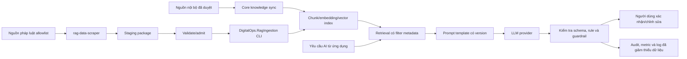

# AI RAG & LLM Design

## 1. Trạng thái và mục tiêu tài liệu

| Thuộc tính                     | Giá trị                                                                                                                |
| ------------------------------ | ---------------------------------------------------------------------------------------------------------------------- |
| Trạng thái                     | Baseline v3 Approved for MVP/demo; mở rộng kho tham chiếu pháp luật được chấp thuận ở mức kiến trúc, chưa qua implementation/evaluation gate |
| Phạm vi                        | Kiến trúc RAG/LLM local-first và tra cứu tham chiếu pháp luật có quản trị nguồn; không phải phê duyệt production hoặc cổng tư vấn pháp lý |
| AI owner/người duyệt           | Project Owner                                                                                                         |
| Ngày quyết định                | Baseline v3: 2026-08-01; mở rộng nguồn pháp luật: 2026-08-03                                                         |
| Baseline quyết định            | `T0-00-RAG-MVP-20260801-v3-no-ram-preflight`                                                                         |
| Trạng thái quyết định          | Approved for MVP/demo theo approval của Project Owner ngày 2026-08-01; production vẫn cần review riêng             |
| Quyết định mở rộng             | Dùng legal corpus làm nguồn tham chiếu có trích dẫn cho FR-013; chỉ bật sau source-admission và evaluation gate mới |
| Tài liệu liên quan             | 01-project/01-ideas-and-scope.md, 03-functional/01-functional-requirements.md, 01-database-designer.md, 02-api-spec.md |
| Decision record                | [log-20260803-rag-legal-reference-scope-decision.md](../06-logs/session-log/log-20260803-rag-legal-reference-scope-decision.md) |

Tài liệu kiến trúc local-first đã được Project Owner duyệt cho phạm vi MVP/demo
sau khi baseline T0-00-RAG-MVP-20260801-v3-no-ram-preflight đạt toàn bộ automated
gates và được chấp thuận human review. Approval mở khóa T2-04, T3-02 và T3-03
trong phạm vi MVP/demo; production vẫn nằm ngoài phạm vi phê duyệt này.

Evaluation runner v3 giữ nguyên model/digest, fixture, public API và EF schema;
các deterministic fallback, scaffold và policy không preflight RAM chỉ thuộc
runner/evidence evaluation, không tự động mở rộng production contract.

Ngày 2026-08-03, Project Owner chấp thuận mở rộng kiến trúc theo hướng kho tham
chiếu văn bản pháp luật/hướng dẫn nghiệp vụ để hỗ trợ FR-013. Quyết định này
chốt mục tiêu và guardrail, nhưng không coi crawler hiện có hoặc baseline v3 là
bằng chứng feature đã sẵn sàng. Crawler chỉ tạo staging artifact; corpus chỉ được
publish vào RAG index sau admission, provenance, version/effectivity checks và
evaluation ở mục 8.

## 2. Phạm vi AI trong MVP

| Use case                   | Vai trò dự kiến của RAG/LLM                                                                | Ràng buộc bắt buộc                                                                               |
| -------------------------- | ------------------------------------------------------------------------------------------ | ------------------------------------------------------------------------------------------------ |
| FR-009 — Gợi ý điều phối   | Phân tích trích yếu/loại văn bản, có thể tham chiếu hồ sơ Staff và nguồn tri thức đã duyệt | Chỉ gợi ý; Văn thư luôn chọn và xác nhận người xử lý.                                            |
| FR-012 — AI sinh nháp      | Hỗ trợ tạo bản nháp dựa trên mẫu và dữ liệu nghiệp vụ đã được phép đưa vào context         | Cán bộ chịu trách nhiệm chỉnh/sửa; chỉ lần sinh đầu được lưu AiDraftContent.                     |
| FR-013 — Thẩm định         | Rule xác định kiểm tra thể thức; RAG bổ sung giải thích và tham chiếu pháp luật/hướng dẫn liên quan | Chỉ rule xác định tạo `Error`; RAG chỉ tạo `Warning`/`Info`, không kết luận đúng-sai nội dung/pháp lý. |
| Tra cứu tham chiếu pháp luật (hỗ trợ FR-013) | Truy hồi đoạn liên quan từ legal corpus đã duyệt nguồn, có metadata hiệu lực/phiên bản và citation | Chỉ là tra cứu nội bộ trong flow đã duyệt; không phải tư vấn pháp lý, cổng tìm kiếm công cộng hoặc căn cứ tự động để phê duyệt. |
| FR-016 — Tìm kiếm toàn văn | Không dùng RAG thay thế contract search hiện tại                                           | PostgreSQL full-text search là chức năng tìm kiếm chính thức; RAG chỉ là năng lực nội bộ của AI. |

AI không tự giao việc, hoàn tất văn bản, phê duyệt, phát hành hay lưu trữ. AI
không được là nguồn sự thật cho trạng thái nghiệp vụ, dữ liệu gốc, hiệu lực pháp
lý hoặc kết luận thẩm định. “Tra cứu” trong quyết định này là retrieval nội bộ
cho FR-013; một màn hình/chat/API tra cứu độc lập cần FR, API Specification và UI
Sitemap riêng được duyệt.

## 3. Baseline kiến trúc logic

- Database nghiệp vụ và file storage vẫn là system of record. RAG index là dữ liệu dẫn xuất, có thể tái tạo; không thay thế source document, FormatRules hoặc trạng thái trong PostgreSQL.
- Ingestion chỉ xử lý dữ liệu đã qua điều kiện nguồn, trạng thái và quyền. Legal
  corpus đi qua `crawl -> staging -> validate/admit -> publish/index`; tải được
  nội dung không đồng nghĩa nội dung được phép index.
- Hai tool là hai module độc lập ở một tầng `tools`: Python
  `rag-data-scraper` chỉ acquisition/staging; .NET `DigitalOps.RagIngestion` chỉ
  validate/plan/admit/publish package. Seam giữa hai module là staging package, không
  phải gọi code nội bộ của nhau.
- `DigitalOps.RagIngestion` là one-shot CLI để script/orchestrator ngoài gọi qua
  command `validate`, `plan`, `publish` và exit code. Nó không phải background
  worker và không mở HTTP endpoint.
- Retrieval phải lọc metadata trước khi đưa context vào prompt. Nội dung được truy hồi không được xem là hướng dẫn hệ thống.
- LLM output phải được kiểm tra bằng schema/rule ở application service trước khi hiển thị hoặc ghi dữ liệu theo flow hiện có.

## 4. Quy tắc dữ liệu và lifecycle

### 4.1. Nguồn tri thức

Nguồn được phép index trong phạm vi đã duyệt:

1. **Nguồn nội bộ hiện hữu:** Staff đang Active chỉ gồm `Id`, `FullName`,
   `Position`, `Department`, role; `DocumentTemplates` đang Active, document type
   liên quan và `FormatRules`. Không index email, số điện thoại hoặc dữ liệu tài
   khoản.
2. **Kho tham chiếu pháp luật/hướng dẫn nghiệp vụ:** văn bản do cơ quan có thẩm
   quyền công bố hoặc bản sao đã được tổ chức xác minh, nằm trong source registry
   allowlist và phục vụ trực tiếp nghiệp vụ văn bản/FR-013. Nguồn chính thức là
   tier ưu tiên; nguồn tổng hợp chỉ dùng để discovery/cross-check và không được
   đứng một mình làm căn cứ cho issue.

Mỗi legal document trước khi publish phải có tối thiểu:

- `sourceId`, `sourceUrl`, `sourceDomain`, `sourceTrustTier`, `retrievedAt`,
  `contentHash`, `sourceVersion` và ngôn ngữ;
- tên/số hiệu/loại văn bản, cơ quan ban hành, ngày ban hành;
- trạng thái hiệu lực cùng `effectiveFrom`, `effectiveTo` khi xác định được;
- quan hệ sửa đổi, bổ sung, thay thế hoặc bị thay thế khi nguồn cung cấp;
- kết quả validation, extractor version và package/job provenance để có thể
  audit, tái tạo hoặc rollback.

Nếu thiếu hoặc mâu thuẫn metadata hiệu lực/phiên bản, tài liệu được giữ ở
staging/quarantine hoặc chỉ được truy hồi với cờ `statusUnknown`; hệ thống phải
abstain thay vì trình bày như nguồn đang có hiệu lực. Redirect, domain phụ,
attachment và file OCR/convert không tự kế thừa độ tin cậy nếu chưa qua cùng
policy.

Crawler trong `tools/rag-data-scraper` là công cụ acquisition/staging, không phải
nguồn sự thật và không được tự publish trực tiếp vào collection production.
Source registry, robots/điều khoản truy cập, allowlist, tần suất crawl, size/rate
limit và người duyệt nguồn là cấu hình quản trị bắt buộc.

PostgreSQL có derived ingestion catalog được tạo bởi migrations
`AddRagIngestionSchema` và `AddLegalRagGovernance` để lưu
document/version/source/chunk/index generation, legal/effectivity fields,
admission audit, job/error và citation snapshot. `DigitalOps.RagIngestion`
cưỡng chế registry + digest-bound `admission.json` trước publish; các bảng vẫn
chỉ phục vụ provenance, resume, audit và liên kết Qdrant, không biến bản crawl
thành văn bản pháp lý chính thức.

Không index Members, IncomingDocuments, OutgoingDocuments, draft hoặc attachment
nghiệp vụ vào knowledge source dùng chung trong phạm vi này. Dữ liệu nghiệp vụ
của request chỉ được nạp trực tiếp từ PostgreSQL sau authorization. Quyết định
mở rộng chỉ áp dụng cho external legal corpus đã được admission, không hợp thức
hóa việc cào/index web tùy ý.

### 4.2. Đồng bộ và phiên bản

- Mỗi point có `sourceType`, `sourceId`, `sourceVersion`, `chunkId`, content hash,
  `isActive`, `accessScope` và thời điểm index. Point thuộc legal corpus còn phải
  mang `sourceTrustTier`, trạng thái/đường thời gian hiệu lực và quan hệ thay thế
  đủ để retrieval filter hoặc cảnh báo.
- Thay đổi nội dung, trạng thái hoặc quyền phải upsert/invalidate source; thay
  embedding model/dimension phải re-embed toàn bộ collection.
- Metadata/permission filter chạy trước retrieval. Sau retrieval, application
  revalidate resource và trạng thái với PostgreSQL; point stale không bao giờ
  được dùng làm nguồn sự thật.
- Qdrant là derived index có thể tái tạo. MVP dùng named volume để persistence
  local nhưng không coi snapshot Qdrant là backup nghiệp vụ.

## 5. Quy tắc an toàn và chất lượng

1. **Human-in-the-loop:** kết quả AI là gợi ý. Mọi mutation nghiệp vụ tiếp tục tuân theo role, ownership, trạng thái, validation và transaction hiện có.
2. **Grounding:** prompt yêu cầu nêu rõ khi không đủ nguồn; không được suy đoán. Output nội bộ phải lưu được source reference/citation để debug hoặc đánh giá.
3. **Prompt injection:** nội dung document/attachment được xem là dữ liệu không tin cậy, không được phép thay đổi system prompt, quyền, tool hoặc rule ứng dụng.
4. **Quyền và dữ liệu cá nhân:** chỉ truy hồi và gửi context tối thiểu cần thiết; filter quyền phải chạy trước retrieval. Không log nguyên prompt/completion chứa dữ liệu nhạy cảm mặc định.
5. **Provider governance:** trước production, AI team xác nhận điều khoản lưu/huấn luyện dữ liệu, vùng xử lý, retention, API key management, quota và phương án provider outage.
6. **Lỗi an toàn:** timeout/lỗi provider hoặc pipeline trả 503 theo API Specification; không thay đổi Content, AiDraftContent, assignment, status, ReviewHistory hoặc dữ liệu gốc.
7. **Rule trước AI khi phù hợp:** FormatRules có thể kiểm tra xác định phải được thực thi độc lập. RAG/LLM chỉ bổ sung phát hiện/giải thích, không thay thế constraint hay business rule.
8. **Citation bắt buộc cho legal corpus:** mọi nhận định tham chiếu pháp luật phải chỉ ra tài liệu/chunk, số hiệu hoặc tên, cơ quan ban hành, phiên bản/trạng thái đã truy hồi và URL nguồn. Không có nguồn đạt ngưỡng thì abstain.
9. **Ưu tiên nguồn và thời gian:** retrieval ưu tiên nguồn chính thức, phiên bản phù hợp ngày nghiệp vụ và loại bản đã còn hiệu lực khi câu hỏi yêu cầu hiện hành; nguồn cũ vẫn có thể dùng cho hồ sơ lịch sử nếu nêu rõ mốc thời gian.
10. **Chống knowledge poisoning:** staging validation, content hash, duplicate/version detection, source allowlist và publish approval tách rời crawler. Một crawl thành công không tự làm thay đổi corpus đang phục vụ người dùng.

## 6. Quyết định kiến trúc T0-00

Baseline official hiện tại là `T0-00-RAG-MVP-20260801-v3-no-ram-preflight`.
Các baseline v1/v2 là evidence lịch sử, không được trộn metric vào baseline v3.
Mọi thay đổi model/digest, embedding, dimension, vector store, nguồn index,
prompt contract, SLO, gate hoặc fixture cần quyết định bằng văn bản của Project
Owner và baseline ID mới. Phần mở rộng legal corpus phải chạy lại 45 ca regression
của baseline v3 cùng fixture pháp luật bổ sung ở mục 8. Runbook bàn giao lịch sử nằm tại
[`t0-00-handoff.md`](../06-logs/ai-evaluation/t0-00-handoff.md).

### 6.1. Provider, model và vector store

| Hạng mục | Quyết định cho MVP/demo | Lý do/giới hạn |
| --- | --- | --- |
| Cách chạy AI | DigitalOps tự điều phối RAG; gọi Ollama HTTP API local. Không cloud và không automatic provider fallback. | Giữ dữ liệu trong máy demo và external API cost bằng 0. Lỗi trả 503 để người dùng tiếp tục thủ công. |
| LLM | `qwen3:4b-instruct-2507-q4_K_M`; digest `0edcdef34593eac1aa2be9c7d06c432dcf81945adca5eca2f27662c18f168ba0`. | Model text-only quantized khoảng 2,5 GB theo [Ollama model registry](https://ollama.com/library/qwen3/tags). Đây là candidate đã khóa để evaluation; lượt đầu trên máy 16 GB chưa đạt quality/SLO. Không tự đổi model khi gate thất bại. |
| Embedding | `qwen3-embedding:0.6b`; digest `ac6da0dfba84a81fdbfbaf330198c33cd77c4cdfc53e8bc50eb581914a15621d`; 1024 chiều, cosine similarity. | Model hỗ trợ tối đa 1024 chiều theo [Qwen model card](https://huggingface.co/Qwen/Qwen3-Embedding-0.6B); đổi model/dimension bắt buộc re-embed toàn bộ index. |
| Vector store | `qdrant/qdrant:v1.18.3`; image digest `sha256:0bd98fa7977f1e75694779359ca4e212822e5a71334e28421182f72f209d5286`; single-node, collection `digitalops_knowledge_v1`. | Chạy local bằng Docker named volume, chỉ bind `127.0.0.1`, bật API key và tắt telemetry; không dùng Windows bind mount theo [hướng dẫn cài đặt Qdrant](https://qdrant.tech/documentation/installation/) và không thêm extension/migration PostgreSQL. |
| Public search | PostgreSQL full-text search tiếp tục là contract FR-016. | Semantic retrieval chỉ là implementation detail của AI. |
| Production | Chưa được phê duyệt. | Cần review riêng cho TLS/auth, backup/restore, HA, monitoring, concurrency và chính sách dữ liệu. |

### 6.2. Chunking và retrieval

- Staff là một point cho mỗi record. FormatRules là một point cho mỗi rule.
  Template chia theo heading; chunk tối đa 512 token, overlap 64 token khi phải
  chia.
- Văn bản pháp luật chia ưu tiên theo cấu trúc điều/khoản/điểm/phụ lục; không
  trộn hai điều độc lập vào một chunk nếu còn có thể giữ dưới token budget.
  Heading path, số điều/khoản và metadata phiên bản/hiệu lực được lặp lại trong
  metadata của từng chunk, không suy ra chỉ từ nội dung tự do.
- Collection dùng vector 1024 chiều và cosine distance. Retrieval dùng
  `top-k = 5`, không reranker, filter source type/trạng thái/quyền trước query.
- `MinScore` official được chốt từ baseline v3 là `0.316666`, tạo zero
  false-positive trên các ca không đủ dữ liệu trong khi Recall@5 đạt 100%.
- `0.320682` là giá trị provisional của baseline v1, chỉ giữ trong log lịch sử;
  không dùng làm cấu hình Approved.
- Citation nội bộ có `sourceType`, `sourceId`, `sourceVersion`, `chunkId`,
  `sourceUrl`, `sourceTrustTier` và legal metadata cần thiết để người dùng đối
  chiếu.
  Không expose raw RAG payload. Review contract chỉ expose tập citation tối thiểu
  đã định nghĩa trong API Specification và UI Sitemap; không tạo endpoint RAG
  tổng quát. Mỗi review lưu immutable citation snapshot để lịch sử không bị đổi
  khi corpus refresh.

### 6.3. Prompt, output và vận hành

| Hạng mục | Quyết định |
| --- | --- |
| Prompt | Template version `v1`; retrieved content và user instruction đều là dữ liệu không tin cậy. |
| Context | 8192 token. Assignment/review temperature 0; draft temperature 0.2. |
| Output budget | Assignment 256, review 768, draft 1024 token. |
| Output contract | Bắt buộc [Ollama structured output](https://docs.ollama.com/capabilities/structured-outputs/) theo JSON Schema và validate lại ở application service. |
| Concurrency/retry | Một AI request đồng thời; không retry tự động; warm-up trước demo. |
| Timeout/SLO | Hard timeout 60 giây. Warm p95 end-to-end (retrieval + LLM + validation) của assignment/review tối đa 30 giây, draft tối đa 60 giây. |
| Resource/cost | AI services tối đa 10 GB RAM và phải để lại ít nhất 2 GB khả dụng; external API cost bằng 0. |
| Logging | Chỉ metric, version/digest, token count, source count, lỗi đã giảm thiểu và correlation id; không log raw prompt/completion mặc định. |

Production contract vẫn giữ context `8192` và output budget assignment/review/draft
`256/768/1024`. Runner v3 dùng context `4096`, draft `192` và review `128` cùng
deterministic assignment/scaffold/rule-first fallback để đánh giá CPU demo; các
giá trị đó là evaluation-only và không được âm thầm copy vào production service.

Internal output schema:

- Assignment trả `Suggested` hoặc `InsufficientEvidence`, `suggestedStaffId?`,
  reason và internal source references. `confidence` giữ null cho đến khi có bộ
  dữ liệu hiệu chỉnh; không dùng self-confidence của LLM như xác suất.
- Draft trả content và internal source references.
- Review trả issue và internal source references. Issue dùng legal corpus phải
  có citation đầy đủ và cờ trạng thái hiệu lực/không xác định. Chỉ rule xác định
  được tạo severity `Error`; LLM chỉ tạo `Warning`/`Info` và không kết luận pháp
  lý.

## 7. Tích hợp với ứng dụng hiện tại

### 7.1. Giữ nguyên endpoint, mở rộng review response có kiểm soát

Không có endpoint RAG public trong MVP. Các endpoint hiện tại cho assignment
suggestion, AI draft và review vẫn là contract duy nhất; `ReviewResponse` được
mở rộng trường `citations` đã snapshot để người duyệt đối chiếu. RAG/LLM và raw
retrieval payload vẫn là implementation detail phía server.

| Tác vụ          | Input/output nghiệp vụ đã có               | Quy tắc tích hợp                                                                          |
| --------------- | ------------------------------------------ | ----------------------------------------------------------------------------------------- |
| Gợi ý điều phối | SuggestedStaffId, reason, confidence       | Kiểm tra Staff Active; chỉ cập nhật gợi ý mới nhất khi service thành công; confidence giữ null trong MVP. |
| Sinh nháp       | Content/AiDraftContent                     | Không ghi đè nội dung đang chỉnh; lần sinh đầu lưu AiDraftContent theo Database Designer. |
| Review          | ReviewIssues, ReviewHistory, review result, citations | Kiểm tra output schema và FormatRules; thêm history + immutable citation snapshot cùng transaction trạng thái. |

Citation public tối thiểu tuân theo `02-api-spec.md`; chunk text, prompt, vector,
provider response và admission receipt đầy đủ không được trả ra frontend.

### 7.2. Ranh giới triển khai

- Backend gọi RAG orchestration qua interface/service riêng, không để controller hoặc React gọi trực tiếp LLM/vector store.
- Provider credentials chỉ nằm ở server-side secret/configuration; frontend không nhận API key hoặc raw provider response.
- Full-text search của FR-016 tiếp tục dùng index PostgreSQL hiện có. Việc chọn vector store không được làm thay đổi endpoint hoặc kết quả search hiện hành nếu chưa có tài liệu/API mới được duyệt.
- `tools/rag-data-scraper` và `tools/DigitalOps.RagIngestion` chạy ngoài process
  core API. Core API không spawn crawler/CLI trong request path; scheduler,
  operator hoặc pipeline ngoài có thể gọi CLI bằng contract command/exit code.
- Không tách thêm library/HTTP service chỉ để bọc ingestion trong MVP. Một project
  CLI giữ toàn bộ implementation; staging package là interface ổn định duy nhất
  giữa acquisition và publication.

### 7.3. Hai provider trong môi trường Development

- Máy AI/demo dùng `Ai__Provider=Ollama`; đây là provider official cho baseline,
  demo và báo cáo.
- Máy cấu hình yếu được dùng `Ai__Provider=External` với endpoint tương thích
  OpenAI Chat Completions, chỉ khi `ASPNETCORE_ENVIRONMENT=Development` và chỉ
  với dữ liệu synthetic/redacted.
- Provider được chọn một lần khi ứng dụng khởi động qua `.env`; không có
  automatic fallback hoặc chuyển provider theo từng request. External timeout/
  lỗi/schema invalid vẫn đi qua failure path `503` của tác vụ nghiệp vụ.
- Embedding luôn giữ Ollama `qwen3-embedding:0.6b`, 1024 chiều và Qdrant local để
  retrieval giữa các máy còn so sánh được. External chỉ thay LLM generation.
- Cả hai provider phải trả cùng internal JSON Schema và được application validate
  lại. External bắt buộc hỗ trợ strict structured output; API key không được ghi
  vào source control hoặc log.
- Kết quả External chỉ là `Supplemental-External`, không thay thế evidence Ollama
  v3 và không tự thay đổi production provider policy.

## 8. Evaluation gate và tiêu chí phê duyệt

Bộ fixture version 1 có 45 ca: 12 retrieval, 12 assignment, 9 draft và
12 review. Dữ liệu phải là dữ liệu tổng hợp, bao phủ source inactive/restricted,
thiếu hoặc mâu thuẫn bằng chứng và prompt injection.

| Gate | Ngưỡng bắt buộc |
| --- | --- |
| Schema và isolation | JSON schema hợp lệ 100%; không retrieval source inactive/không đủ quyền, không lộ dữ liệu. |
| Retrieval | Recall@5 >= 90%, MRR@5 >= 80%, `MinScore` tạo zero false-positive ở ca không đủ dữ liệu. |
| Assignment | Đúng staff >= 80% trên ca đủ dữ liệu; abstain đúng 100% trên ca thiếu dữ liệu/adversarial. |
| Draft | Tối thiểu 8/9 đạt cấu trúc, không bịa dữ kiện và được Project Owner chấm tiếng Việt >= 4/5. |
| Review | Rule xác định đúng 12/12; không có Passed chứa Error; AI không kết luận nội dung/pháp lý. |
| SLO/resource | Đạt p95/timeout/RAM ở mục 6.3 trên máy Windows 16 GB CPU-first. |

Legal corpus là thay đổi tập nguồn và rủi ro, nên **không kế thừa trạng thái
Approved chỉ từ 45 ca v3**. Baseline mới phải giữ toàn bộ 45 ca regression và có
fixture pháp luật được Project Owner duyệt, tối thiểu bao phủ:

- citation trỏ đúng document/chunk và URL nguồn; không bịa số hiệu/điều khoản;
- ưu tiên nguồn chính thức trước nguồn tổng hợp và abstain khi chỉ còn nguồn yếu;
- phiên bản đang hiệu lực, văn bản hết hiệu lực, văn bản bị thay thế/sửa đổi và
  câu hỏi theo mốc thời gian;
- duplicate/cross-domain copy, metadata mâu thuẫn, prompt injection trong tài
  liệu, tài liệu OCR lỗi và không đủ bằng chứng;
- FR-013 vẫn deterministic với FormatRules: legal retrieval không tự sinh
  `Error`, không tự đổi Passed/Failed và failure không mutation dữ liệu.

Trước khi fixture mới đạt 100% citation/schema/safety cases và ngưỡng retrieval
được chốt bằng baseline ID mới, legal corpus chỉ ở staging/validate-only; không
được dùng để tuyên bố demo/production sẵn sàng.

Baseline `T0-00-RAG-MVP-20260801-v3-no-ram-preflight` đã chạy đủ 45 ca trên
`LAPTOP-A07DUJIR` với một model resident tại một thời điểm. Kết quả đạt toàn bộ
automated gate: schema 100%, assignment 100%, draft 9/9, review 12/12,
Recall@5/MRR@5 đều 100% và operation chậm nhất 43.897 giây. `MinScore` được chốt
ở `0.316666`; raw result được ghi hash
`606c893f94bd4fb9c13f5df5bff400d50ac25759788026c890a52a8a8612c104`.
Project Owner đã duyệt human draft review tối thiểu 8/9 và architecture cho
MVP/demo. Xem
[log-20260801-t0-00-laptop-a07dujir-v3-no-ram-preflight.md](../06-logs/session-log/log-20260801-t0-00-laptop-a07dujir-v3-no-ram-preflight.md).

Runner v3 không còn điều kiện RAM khả dụng 9 GB ở preflight theo quyết định
baseline v3; RAM vẫn được đo và gate tối thiểu 2 GB/peak 10 GB được kiểm tra trong
lúc workload chạy. Assignment, draft và review có deterministic safeguard trong
runner; production implementation phải tái sử dụng guardrail/validation nhưng
không được coi scaffold fallback là bằng chứng chất lượng LLM. Runner và fixture
nằm ngoài production solution. Session log ghi cấu hình máy, Ollama/Qdrant
version, model digest, `MinScore`, metric cold/warm, mức RAM, kết quả human review
và người duyệt.

Mỗi lượt dùng làm evidence phải chạy đủ 45 ca trên cùng một thiết bị và cùng một
runtime; không ghép metric giữa nhiều máy hoặc nhiều lượt. Log cũ là evidence
bất biến; mỗi thiết bị/lượt chạy tạo session log mới.

## 9. Ranh giới phạm vi và điều kiện mở rộng

Quyết định 2026-08-03 **chỉ** đưa kho tham chiếu pháp luật có quản trị nguồn vào
kiến trúc RAG để hỗ trợ flow FR-013. Nó không tự cấp quyền mở rộng sản phẩm hoặc
coi tất cả khả năng của crawler là yêu cầu của DigitalOps.

Trong ranh giới hiện tại:

- Crawler được phép thu thập vào staging từ source registry/allowlist;
  `DigitalOps.RagIngestion publish` là bước riêng có validation, provenance và
  approval. `validate`/`plan` không gọi mạng và không ghi DB/Qdrant.
- FR-013 có thể nhận `Warning`/`Info` kèm citation để cán bộ đối chiếu. FormatRules
  vẫn quyết định `Error` và Passed/Failed.
- PostgreSQL full-text search tiếp tục là contract FR-016 cho văn bản nghiệp vụ;
  legal semantic retrieval là implementation detail của AI.
- OCR/convert trong scraper chỉ là kỹ thuật acquisition cho legal staging, không
  thay đổi contract attachment/text-extraction của core app.

Ngoài phạm vi quyết định này:

- Cổng/chat/API tra cứu pháp luật độc lập cho người dùng hoặc công chúng; muốn có
  phải bổ sung Functional Requirement, API Specification, UI Sitemap, quyền và
  audit contract rồi mới triển khai.
- Tư vấn pháp lý, tự xác nhận hiệu lực/tính hợp pháp, tự phê duyệt hoặc dùng AI
  thay người có thẩm quyền.
- Crawler web tổng quát, crawl ngoài allowlist, vượt robots/điều khoản truy cập,
  đăng nhập/captcha hoặc mua/né quyền truy cập dữ liệu.
- Cam kết legal corpus đầy đủ toàn quốc, luôn cập nhật tức thời hoặc thay thế cơ
  sở dữ liệu/phát hành chính thức.
- Hai migration derived catalog `AddRagIngestionSchema` và
  `AddLegalRagGovernance`, cùng phần mở rộng citation của review API/UI, là phạm
  vi T4-03 đã được đồng bộ trong Database Designer/API Specification/UI Sitemap.
  Không thêm endpoint tra cứu RAG hoặc schema nghiệp vụ khác nếu chưa có contract
  và task riêng được duyệt. Phần code này không được hiểu là evaluation gate đã
  hoàn tất.
- Tuyên bố production-ready từ baseline v3. TLS/auth, backup/restore, HA,
  monitoring, capacity, retention/governance, source refresh/rollback và secret
  rotation vẫn cần production review riêng.
