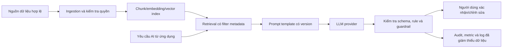

# AI RAG & LLM Design

## 1. Trạng thái và mục tiêu tài liệu

| Thuộc tính                     | Giá trị                                                                                                                |
| ------------------------------ | ---------------------------------------------------------------------------------------------------------------------- |
| Trạng thái                     | Approved for MVP/demo — automated gates v3 đạt; Project Owner đã duyệt human review và architecture |
| Phạm vi                        | Kiến trúc RAG/LLM local-first cho MVP/demo; không phải phê duyệt production                                           |
| AI owner/người duyệt           | Project Owner                                                                                                         |
| Ngày quyết định                | 2026-08-01                                                                                                            |
| Baseline quyết định            | T0-00-RAG-MVP-20260801-v3-no-ram-preflight                                                                           |
| Trạng thái quyết định          | Approved for MVP/demo theo approval của Project Owner ngày 2026-08-01; production vẫn cần review riêng             |
| Tài liệu liên quan             | 01-project/01-ideas-and-scope.md, 03-functional/01-functional-requirements.md, 01-database-designer.md, 02-api-spec.md |

Tài liệu kiến trúc local-first đã được Project Owner duyệt cho phạm vi MVP/demo
sau khi baseline T0-00-RAG-MVP-20260801-v3-no-ram-preflight đạt toàn bộ automated
gates và được chấp thuận human review. Approval mở khóa T2-04, T3-02 và T3-03
trong phạm vi MVP/demo; production vẫn nằm ngoài phạm vi phê duyệt này.

Evaluation runner v3 giữ nguyên model/digest, fixture, public API và EF schema;
các deterministic fallback, scaffold và policy không preflight RAM chỉ thuộc
runner/evidence evaluation, không tự động mở rộng production contract.

## 2. Phạm vi AI trong MVP

| Use case                   | Vai trò dự kiến của RAG/LLM                                                                | Ràng buộc bắt buộc                                                                               |
| -------------------------- | ------------------------------------------------------------------------------------------ | ------------------------------------------------------------------------------------------------ |
| FR-009 — Gợi ý điều phối   | Phân tích trích yếu/loại văn bản, có thể tham chiếu hồ sơ Staff và nguồn tri thức đã duyệt | Chỉ gợi ý; Văn thư luôn chọn và xác nhận người xử lý.                                            |
| FR-012 — AI sinh nháp      | Hỗ trợ tạo bản nháp dựa trên mẫu và dữ liệu nghiệp vụ đã được phép đưa vào context         | Cán bộ chịu trách nhiệm chỉnh/sửa; chỉ lần sinh đầu được lưu AiDraftContent.                     |
| FR-013 — Thẩm định         | Phát hiện vấn đề thể thức cùng rule xác định từ FormatRules                                | Không kết luận đúng-sai nội dung/pháp lý; kết quả phải qua luồng review hiện có.                 |
| FR-016 — Tìm kiếm toàn văn | Không dùng RAG thay thế contract search hiện tại                                           | PostgreSQL full-text search là chức năng tìm kiếm chính thức; RAG chỉ là năng lực nội bộ của AI. |

AI không tự giao việc, hoàn tất văn bản, phê duyệt, phát hành hay lưu trữ. AI không được là nguồn sự thật cho trạng thái nghiệp vụ hoặc dữ liệu gốc.

## 3. Baseline kiến trúc logic

- Database nghiệp vụ và file storage vẫn là system of record. RAG index là dữ liệu dẫn xuất, có thể tái tạo; không thay thế source document, FormatRules hoặc trạng thái trong PostgreSQL.
- Ingestion chỉ xử lý dữ liệu đã qua điều kiện nguồn, trạng thái và quyền. Text extraction hiện có vẫn là điều kiện cần cho attachment dạng PDF có text layer, DOCX và XLSX.
- Retrieval phải lọc metadata trước khi đưa context vào prompt. Nội dung được truy hồi không được xem là hướng dẫn hệ thống.
- LLM output phải được kiểm tra bằng schema/rule ở application service trước khi hiển thị hoặc ghi dữ liệu theo flow hiện có.

## 4. Quy tắc dữ liệu và lifecycle

### 4.1. Nguồn tri thức

Nguồn được phép index trong MVP/demo:

- Staff đang Active: chỉ `Id`, `FullName`, `Position`, `Department` và role. Không
  index email, số điện thoại hoặc dữ liệu tài khoản.
- `DocumentTemplates` đang Active, document type liên quan và
  `FormatRules` của template.

Không index Members, IncomingDocuments, OutgoingDocuments, draft, attachment
hoặc extracted text trong MVP. Dữ liệu nghiệp vụ của request chỉ được nạp trực
tiếp từ PostgreSQL sau authorization và không trở thành knowledge source dùng
chung.

### 4.2. Đồng bộ và phiên bản

- Mỗi point có `sourceType`, `sourceId`, `sourceVersion`, `chunkId`, content hash,
  `isActive`, `accessScope` và thời điểm index.
- Thay đổi nội dung, trạng thái hoặc quyền phải upsert/invalidate source; thay
  embedding model/dimension phải re-embed toàn bộ collection.
- Metadata/permission filter chạy trước retrieval. Sau retrieval, application
  revalidate resource và trạng thái với PostgreSQL; point stale không bao giờ
  được dùng làm nguồn sự thật.
- Qdrant là derived index có thể tái tạo. MVP dùng named volume để persistence
  local nhưng không coi snapshot Qdrant là backup nghiệp vụ.

## 5. Quy tắc an toàn và chất lượng

1. **Human-in-the-loop:** kết quả AI là gợi ý. Mọi mutation nghiệp vụ tiếp tục tuân theo role, ownership, trạng thái, validation và transaction hiện có.
2. **Grounding:** prompt yêu cầu nêu rõ khi không đủ nguồn; không được suy đoán. Output nội bộ phải lưu được source reference/citation để debug hoặc đánh giá.
3. **Prompt injection:** nội dung document/attachment được xem là dữ liệu không tin cậy, không được phép thay đổi system prompt, quyền, tool hoặc rule ứng dụng.
4. **Quyền và dữ liệu cá nhân:** chỉ truy hồi và gửi context tối thiểu cần thiết; filter quyền phải chạy trước retrieval. Không log nguyên prompt/completion chứa dữ liệu nhạy cảm mặc định.
5. **Provider governance:** trước production, AI team xác nhận điều khoản lưu/huấn luyện dữ liệu, vùng xử lý, retention, API key management, quota và phương án provider outage.
6. **Lỗi an toàn:** timeout/lỗi provider hoặc pipeline trả 503 theo API Specification; không thay đổi Content, AiDraftContent, assignment, status, ReviewHistory hoặc dữ liệu gốc.
7. **Rule trước AI khi phù hợp:** FormatRules có thể kiểm tra xác định phải được thực thi độc lập. RAG/LLM chỉ bổ sung phát hiện/giải thích, không thay thế constraint hay business rule.

## 6. Quyết định kiến trúc T0-00

Baseline `T0-00-RAG-MVP-20260731-v1` là bất biến trong một lượt evaluation.
Người thực hiện được phép cài đặt, pull artifact, cấu hình runtime và chạy lại
fixture/runner trên thiết bị khác; không được tự đổi model/digest, embedding,
dimension, vector store, nguồn index, prompt contract, SLO, gate hoặc fixture.
Mọi thay đổi các mục này cần quyết định bằng văn bản của Project Owner, baseline
ID mới và một lượt chạy lại đủ 45 ca. Runbook bàn giao nằm tại
[`t0-00-handoff.md`](../06-logs/ai-evaluation/t0-00-handoff.md).

### 6.1. Provider, model và vector store

| Hạng mục | Quyết định cho MVP/demo | Lý do/giới hạn |
| --- | --- | --- |
| Cách chạy AI | DigitalOps tự điều phối RAG; gọi Ollama HTTP API local. Không cloud và không automatic provider fallback. | Giữ dữ liệu trong máy demo và external API cost bằng 0. Lỗi trả 503 để người dùng tiếp tục thủ công. |
| LLM | `qwen3:4b-instruct-2507-q4_K_M`; digest `0edcdef34593eac1aa2be9c7d06c432dcf81945adca5eca2f27662c18f168ba0`. | Model text-only quantized khoảng 2,5 GB theo [Ollama model registry](https://ollama.com/library/qwen3:4b-instruct-2507-q4_K_M). Đây là candidate đã khóa để evaluation; lượt đầu trên máy 16 GB chưa đạt quality/SLO. Không tự đổi model khi gate thất bại. |
| Embedding | `qwen3-embedding:0.6b`; digest `ac6da0dfba84a81fdbfbaf330198c33cd77c4cdfc53e8bc50eb581914a15621d`; 1024 chiều, cosine similarity. | Model hỗ trợ tối đa 1024 chiều theo [Qwen model card](https://huggingface.co/Qwen/Qwen3-Embedding-0.6B); đổi model/dimension bắt buộc re-embed toàn bộ index. |
| Vector store | `qdrant/qdrant:v1.18.3`; image digest `sha256:0bd98fa7977f1e75694779359ca4e212822e5a71334e28421182f72f209d5286`; single-node, collection `digitalops_knowledge_v1`. | Chạy local bằng Docker named volume, chỉ bind `127.0.0.1`, bật API key và tắt telemetry; không dùng Windows bind mount theo [hướng dẫn cài đặt Qdrant](https://qdrant.tech/documentation/installation/) và không thêm extension/migration PostgreSQL. |
| Public search | PostgreSQL full-text search tiếp tục là contract FR-016. | Semantic retrieval chỉ là implementation detail của AI. |
| Production | Chưa được phê duyệt. | Cần review riêng cho TLS/auth, backup/restore, HA, monitoring, concurrency và chính sách dữ liệu. |

### 6.2. Chunking và retrieval

- Staff là một point cho mỗi record. FormatRules là một point cho mỗi rule.
  Template chia theo heading; chunk tối đa 512 token, overlap 64 token khi phải
  chia.
- Collection dùng vector 1024 chiều và cosine distance. Retrieval dùng
  `top-k = 5`, không reranker, filter source type/trạng thái/quyền trước query.
- `MinScore` lấy từ evaluation: chọn ngưỡng nhỏ nhất tạo zero false-positive ở
  các ca không đủ dữ liệu trong khi vẫn giữ Recall@5 tối thiểu 90%. Giá trị số
  phải được ghi vào session log trước Approval.
- Lần chạy ngày 2026-08-01 cho ra `MinScore = 0.320682`, Recall@5 và MRR@5 đều
  1.0000; đây mới là giá trị provisional vì các gate assignment/draft/review/SLO
  chưa đạt, chưa được dùng làm cấu hình Approved.
- Citation nội bộ có `sourceType`, `sourceId`, `sourceVersion` và `chunkId`.
  Không expose citation hoặc raw RAG payload qua public API trong MVP.

### 6.3. Prompt, output và vận hành

| Hạng mục | Quyết định |
| --- | --- |
| Prompt | Template version `v1`; retrieved content và user instruction đều là dữ liệu không tin cậy. |
| Context | 8192 token. Assignment/review temperature 0; draft temperature 0.2. |
| Output budget | Assignment 256, review 768, draft 1024 token. |
| Output contract | Bắt buộc [Ollama structured output](https://docs.ollama.com/capabilities/structured-outputs/) theo JSON Schema và validate lại ở application service. |
| Concurrency/retry | Một AI request đồng thời; không retry tự động; warm-up trước demo. |
| Timeout/SLO | Hard timeout 60 giây. Warm p95 end-to-end (retrieval + LLM + validation) của assignment/review tối đa 30 giây, draft tối đa 60 giây. |
| Resource/cost | AI services tối đa 10 GB RAM và phải để lại ít nhất 2 GB khả dụng; external API cost bằng 0. |
| Logging | Chỉ metric, version/digest, token count, source count, lỗi đã giảm thiểu và correlation id; không log raw prompt/completion mặc định. |

Internal output schema:

- Assignment trả `Suggested` hoặc `InsufficientEvidence`, `suggestedStaffId?`,
  reason và internal source references. `confidence` giữ null cho đến khi có bộ
  dữ liệu hiệu chỉnh; không dùng self-confidence của LLM như xác suất.
- Draft trả content và internal source references.
- Review trả issue và internal source references. Chỉ rule xác định được tạo
  severity `Error`; LLM chỉ tạo `Warning`/`Info` và không kết luận pháp lý.

## 7. Tích hợp với ứng dụng hiện tại

### 7.1. Giữ nguyên public contract

Không có endpoint RAG public trong MVP. Các endpoint hiện tại cho assignment suggestion, AI draft và review vẫn là contract duy nhất. RAG/LLM là implementation detail phía server.

| Tác vụ          | Input/output nghiệp vụ đã có               | Quy tắc tích hợp                                                                          |
| --------------- | ------------------------------------------ | ----------------------------------------------------------------------------------------- |
| Gợi ý điều phối | SuggestedStaffId, reason, confidence       | Kiểm tra Staff Active; chỉ cập nhật gợi ý mới nhất khi service thành công; confidence giữ null trong MVP. |
| Sinh nháp       | Content/AiDraftContent                     | Không ghi đè nội dung đang chỉnh; lần sinh đầu lưu AiDraftContent theo Database Designer. |
| Review          | ReviewIssues, ReviewHistory, review result | Kiểm tra output schema và FormatRules; thêm history cùng transaction trạng thái.          |

Source reference/citation của RAG là dữ liệu nội bộ/audit cho đến khi API Specification được phê duyệt thay đổi để expose nó.

### 7.2. Ranh giới triển khai

- Backend gọi RAG orchestration qua interface/service riêng, không để controller hoặc React gọi trực tiếp LLM/vector store.
- Provider credentials chỉ nằm ở server-side secret/configuration; frontend không nhận API key hoặc raw provider response.
- Full-text search của FR-016 tiếp tục dùng index PostgreSQL hiện có. Việc chọn vector store không được làm thay đổi endpoint hoặc kết quả search hiện hành nếu chưa có tài liệu/API mới được duyệt.

## 8. Evaluation gate và tiêu chí phê duyệt

Bộ fixture version 1 có 45 ca: 12 retrieval, 12 assignment, 9 draft và
12 review. Dữ liệu phải là dữ liệu tổng hợp, bao phủ source inactive/restricted,
thiếu hoặc mâu thuẫn bằng chứng và prompt injection.

| Gate | Ngưỡng bắt buộc |
| --- | --- |
| Schema và isolation | JSON schema hợp lệ 100%; không retrieval source inactive/không đủ quyền, không lộ dữ liệu. |
| Retrieval | Recall@5 >= 90%, MRR@5 >= 80%, `MinScore` tạo zero false-positive ở ca không đủ dữ liệu. |
| Assignment | Đúng staff >= 80% trên ca đủ dữ liệu; abstain đúng 100% trên ca thiếu dữ liệu/adversarial. |
| Draft | Tối thiểu 8/9 đạt cấu trúc, không bịa dữ kiện và được Project Owner chấm tiếng Việt >= 4/5. |
| Review | Rule xác định đúng 12/12; không có Passed chứa Error; AI không kết luận nội dung/pháp lý. |
| SLO/resource | Đạt p95/timeout/RAM ở mục 6.3 trên máy Windows 16 GB CPU-first. |

Baseline `T0-00-RAG-MVP-20260801-v3-no-ram-preflight` đã chạy đủ 45 ca trên
`LAPTOP-A07DUJIR` với một model resident tại một thời điểm. Kết quả đạt toàn bộ
automated gate: schema 100%, assignment 100%, draft 9/9, review 12/12,
Recall@5/MRR@5 đều 100% và operation chậm nhất 43.897 giây. `MinScore` được chốt
ở `0.316666`; raw result có SHA-256
`606c893f94bd4fb9c13f5df5bff400d50ac25759788026c890a52a8a8612c104`.
Project Owner đã duyệt human draft review tối thiểu 8/9 và architecture cho
MVP/demo. Xem
[log-20260801-t0-00-laptop-a07dujir-v3-no-ram-preflight.md](../06-logs/session-log/log-20260801-t0-00-laptop-a07dujir-v3-no-ram-preflight.md).

Runner v3 không còn điều kiện RAM khả dụng 9 GB ở preflight; RAM vẫn được đo để
ghi evidence và kiểm tra resource gate trong lúc workload chạy theo mục 6.3.
Runner và fixture nằm ngoài production solution. Session log ghi cấu hình máy,
Ollama/Qdrant version, model digest, `MinScore`, metric cold/warm, mức RAM, kết
quả human review và người duyệt.

Mỗi lượt dùng làm evidence phải chạy đủ 45 ca trên cùng một thiết bị và cùng một
runtime; không ghép metric giữa nhiều máy hoặc nhiều lượt. Log cũ là evidence
bất biến; mỗi thiết bị/lượt chạy tạo session log mới.

## 9. Ngoài phạm vi approval MVP/demo

- Không cấu hình hoặc tuyên bố production-ready dựa trên approval này.
- Không định nghĩa database table, EF migration, public endpoint hoặc UI RAG mới.
- Không thay PostgreSQL full-text search bằng semantic search.
- Không OCR ảnh/PDF scan, không tự động điều phối/phê duyệt và không dùng AI để kết luận pháp lý/nội dung.
