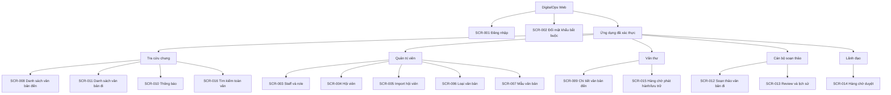

# UI Sitemap And Wireframe

## 1. Mục tiêu tài liệu

### 1.1. Mục đích

- Định nghĩa cấu trúc màn hình, điều hướng và hành vi UI cho DigitalOps Web MVP.
- Đồng bộ với Project-Document/03-functional/01-functional-requirements.md và Project-Document/02-architecture/02-api-spec.md; mỗi màn hình phải truy được use case và API hỗ trợ.
- Làm cơ sở để triển khai React + Vite + TypeScript + Ant Design và kiểm thử luồng nghiệp vụ trước khi đầu tư thiết kế trực quan.

### 1.2. Phạm vi thiết kế

MVP ưu tiên thao tác chính xác, biểu mẫu đầy đủ, hiển thị lỗi rõ ràng và luồng trạng thái có kiểm soát. Màn hình được thiết kế desktop-first tại chiều rộng từ 1024px; tiêu chí kiểm thử chính là 1280 × 720 và 1024px.

Không thiết kế dashboard số liệu vì API chưa có contract tổng hợp. Không thuộc phạm vi đợt này: nhận diện thương hiệu, responsive mobile, rich-text/WYSIWYG, xem trước Word/PDF, in ấn, OCR, notification realtime và tối ưu trải nghiệm nâng cao.

## 2. Quy ước

### 2.1. Ký hiệu wireframe

| Ký hiệu          | Ý nghĩa                                         |
| ---------------- | ----------------------------------------------- |
| [Nút]            | Thao tác người dùng có thể nhấn                 |
| (Trường nhập)    | Input, textarea hoặc date picker                |
| &lt;Lựa chọn&gt; | Select, filter hoặc bộ chọn dữ liệu             |
| {Khối phụ}       | Panel, drawer, modal hoặc khu vực thông tin phụ |
| \| Cột \|        | Bảng dữ liệu                                    |
| --&gt;           | Điều hướng hoặc chuyển bước sau thao tác        |
| \*               | Trường bắt buộc                                 |
| [Trạng thái]     | Tag/Badge trạng thái, luôn đi kèm nhãn chữ      |

Mã màn hình dùng tiền tố SCR. Một màn hình có thể có nhiều route liên quan, ví dụ list, form tạo và chi tiết; tab và modal không cần mã màn hình riêng nếu không có route độc lập.

### 2.2. Quy ước trạng thái màn hình

| Trạng thái            | Cách hiển thị và xử lý                                                                              |
| --------------------- | --------------------------------------------------------------------------------------------------- |
| Đang tải              | Skeleton hoặc spinner tại vùng dữ liệu; vô hiệu hóa thao tác có thể tạo yêu cầu trùng.              |
| Không có dữ liệu      | Empty state có mô tả và nút tạo mới khi người dùng có quyền.                                        |
| Lỗi biểu mẫu 400/422  | Hiển thị lỗi ngay dưới trường tương ứng; lỗi import hiển thị theo dòng và cột.                      |
| Không có quyền 403    | Ẩn action không được phép; nếu truy cập route trực tiếp, hiển thị trang Forbidden có nút quay lại.  |
| Chưa xác thực 401     | Xóa phiên client và chuyển về /login.                                                               |
| Xung đột 409          | Toast nêu nguyên nhân, không tự ghi đè form; tải lại resource mới nhất sau khi người dùng xác nhận. |
| AI không sẵn sàng 503 | Hiển thị lỗi có thể thử lại; giữ nguyên nội dung, gợi ý và trạng thái đang có trên màn hình.        |

Nhãn trạng thái nghiệp vụ được ánh xạ từ enum API:

| Dữ liệu         | Giá trị API                                                                        | Nhãn UI                                                                        |
| --------------- | ---------------------------------------------------------------------------------- | ------------------------------------------------------------------------------ |
| Văn bản đến     | New, InProgress, Overdue, Completed                                                | Mới, Đang xử lý, Quá hạn, Hoàn tất                                             |
| Văn bản đi      | AiDraft, Editing, PendingReview, ReviewFailed, PendingApproval, Approved, Archived | Nháp AI, Đang chỉnh sửa, Chờ thẩm định, Chưa đạt, Chờ duyệt, Đã duyệt, Lưu trữ |
| Review          | Passed, Failed                                                                     | Đạt, Chưa đạt                                                                  |
| Trích xuất file | Pending, Processing, Succeeded, Failed, Unsupported                                | Chờ trích xuất, Đang trích xuất, Đã trích xuất, Trích xuất lỗi, Không hỗ trợ   |
| Reminder        | BeforeDeadline, DueDate, Overdue                                                   | Sắp đến hạn, Đến hạn, Quá hạn                                                  |

### 2.3. Quy ước traceability

- Mỗi dòng trong danh sách màn hình ghi mã SCR, route, role, FR và endpoint API chính.
- API trong tài liệu dùng base route /api/v1; UI chỉ gọi DTO/response đã định nghĩa, không dùng EF entity hoặc trường kỹ thuật nội bộ.
- Action cập nhật trạng thái luôn dùng resource mới nhất trả về từ API để cập nhật giao diện.
- Tên role API được ánh xạ sang UI: Administrator = Quản trị viên, Clerk = Văn thư, Drafter = Cán bộ xử lý/soạn thảo, Leader = Lãnh đạo.

### 2.4. Quy ước màu sắc

UI sử dụng theme mặc định của Ant Design, chỉ dùng màu semantic từ component chuẩn:

- Primary cho hành động chính; Danger chỉ cho thao tác vô hiệu hóa/xóa attachment sau xác nhận.
- Tag hoặc Badge status cho trạng thái nghiệp vụ; nhãn chữ là bắt buộc, không truyền đạt ý nghĩa chỉ bằng màu.
- Không định nghĩa logo, palette thương hiệu, minh họa hay hệ thống thiết kế riêng trong MVP. File 02-color-guidelines.md không thay đổi ở đợt này.

## 3. Phạm vi UI MVP

### 3.1. Nguyên tắc triển khai

- Một ứng dụng web có App Shell chung: sidebar, header, vùng nội dung và route guard.
- Dùng Ant Design Table, Form, Input, Select, DatePicker, Modal, Drawer, Upload, Tabs, Tag/Badge, Alert, Result và Pagination theo nhu cầu; ưu tiên component mặc định thay vì component tự thiết kế.
- Editor văn bản đi là textarea/plain text. Bản AI đầu tiên chỉ đọc ở panel so sánh; người dùng sửa trường Content hiện tại.
- Upload và download luôn qua API. UI không nhận hoặc hiển thị fileUrl, signed URL, extractedText, extractionError hay raw AI response.

### 3.2. Ngoài phạm vi

- Không có màn hình dashboard KPI, mobile-first, email/SMS, OCR, job quản trị trích xuất text, refresh token hoặc server-side logout.
- Không bổ sung API mới. Số liệu, trạng thái, danh sách và quyền đều dựa trên API specification đã có.
- Ảnh và PDF scan vẫn upload bình thường nhưng hiển thị trạng thái Không hỗ trợ cho việc trích xuất/tìm kiếm.

## 4. Phân tích vai trò và quyền truy cập UI

| Role                   | Menu/chức năng thay đổi                                                                                        | Quyền xem dùng chung                          |
| ---------------------- | -------------------------------------------------------------------------------------------------------------- | --------------------------------------------- |
| Quản trị viên          | Staff; Hội viên; Loại văn bản; Mẫu văn bản; tạo/reset/vô hiệu hóa tài khoản và quản trị danh mục/mẫu           | Xem văn bản đến/đi, reminder, search toàn văn |
| Văn thư                | Hội viên; tiếp nhận/sửa/điều phối/hoàn tất văn bản đến; upload incoming attachment; hàng chờ phát hành/lưu trữ | Xem văn bản đến/đi, reminder, search toàn văn |
| Cán bộ xử lý/soạn thảo | Tạo/sửa văn bản đi do mình soạn; AI draft; review; outgoing attachment; lookup hội viên Active trong form      | Xem văn bản đến/đi, reminder, search toàn văn |
| Lãnh đạo               | Hàng chờ duyệt; duyệt hoặc trả văn bản đi                                                                      | Xem văn bản đến/đi, reminder, search toàn văn |

- Một Staff có thể có nhiều role; menu và action là hợp quyền của tất cả role hiện có.
- Staff active luôn xem được toàn bộ danh sách/chi tiết văn bản, nhưng UI chỉ hiện nút thay đổi khi role, ownership và trạng thái cho phép.
- Reminder chỉ hiển thị cho người nhận; Administrator có thể lọc theo người nhận khi hỗ trợ vận hành.
- Staff inactive không có phiên hợp lệ và không được hiển thị App Shell.

### 4.1. Route guard và phiên làm việc

1. Route /login là công khai. Sau POST /auth/login, client lưu access token và LoginResponse trong bộ nhớ phiên an toàn của ứng dụng.
2. App khởi tạo bằng GET /auth/me. Nếu trả 401, xóa phiên và về /login.
3. Khi mustChangePassword = true, route guard chỉ cho phép /change-password và menu đăng xuất. Mọi route nghiệp vụ chuyển tới /change-password.
4. POST /auth/change-password thành công thay token và nạp lại thông tin role; sau đó chuyển về /incoming-documents.
5. Đăng xuất là thao tác client xóa token/dữ liệu phiên và chuyển về /login; không gọi endpoint server.

## 5. Sitemap tổng thể



### 5.1. Nhóm màn hình

| Nhóm                 | Màn hình                           | Mục đích                                                                  |
| -------------------- | ---------------------------------- | ------------------------------------------------------------------------- |
| Xác thực             | SCR-001, SCR-002                   | Đăng nhập và buộc đổi mật khẩu tạm.                                       |
| Tra cứu chung        | SCR-008, SCR-010, SCR-011, SCR-016 | Mọi Staff active tra cứu văn bản, reminder của mình và tìm kiếm toàn văn. |
| Quản trị dữ liệu     | SCR-003 đến SCR-007                | Quản lý Staff, hội viên, import, loại và mẫu văn bản.                     |
| Vận hành văn bản đến | SCR-009                            | Tiếp nhận, attachment, AI gợi ý, xác nhận điều phối và hoàn tất.          |
| Vận hành văn bản đi  | SCR-012, SCR-013                   | Tạo, soạn, AI draft, attachment, review và lịch sử.                       |
| Phê duyệt/phát hành  | SCR-014, SCR-015                   | Lãnh đạo duyệt/trả; Văn thư cấp số, ghi ngày phát hành và lưu trữ.        |

## 6. Navigation chính

### 6.1. App Shell desktop

- Sidebar cố định bên trái, rộng tiêu chuẩn Ant Design; header chứa tên hệ thống, badge reminder, tên Staff và menu Đổi mật khẩu/Đăng xuất.
- Trang mặc định sau đăng nhập là /incoming-documents. Nếu user không có action phù hợp, trang vẫn ở chế độ tra cứu.
- Không tạo mục Dashboard. Nút reminder ở header dẫn tới /reminders; badge chỉ hiển thị số chưa đọc nếu client đã lấy được danh sách reminder, không tự suy diễn số liệu.

| Vị trí           | Menu/điều hướng                                             | Điều kiện hiện                                     |
| ---------------- | ----------------------------------------------------------- | -------------------------------------------------- |
| Sidebar chung    | Văn bản đến, Văn bản đi, Tìm kiếm toàn văn                  | BusinessAccess                                     |
| Sidebar quản trị | Staff, Hội viên, Import hội viên, Loại văn bản, Mẫu văn bản | Administrator; Hội viên/Import cũng hiện cho Clerk |
| Sidebar vận hành | Hàng chờ duyệt, Hàng chờ phát hành/lưu trữ                  | Leader, Clerk tương ứng                            |
| Header           | Thông báo, Hồ sơ phiên, Đổi mật khẩu, Đăng xuất             | Staff active                                       |
| Chi tiết văn bản | Action theo role, owner và trạng thái resource hiện tại     | Không thay action chỉ dựa vào menu                 |

### 6.2. Quy tắc hiển thị action

| Action                                                   | Khi hiển thị                                   |
| -------------------------------------------------------- | ---------------------------------------------- |
| Tạo/sửa Staff, role, reset password                      | Administrator                                  |
| Tạo/sửa/vô hiệu hóa hội viên và import                   | Administrator hoặc Clerk                       |
| Tạo/sửa loại, mẫu và FormatRules                         | Administrator                                  |
| Tạo/sửa incoming, AI assignment, xác nhận giao, hoàn tất | Clerk; hoàn tất cũng hiện cho Assigned Staff   |
| Upload/xóa incoming attachment                           | Clerk và incoming chưa Completed               |
| Tạo/sửa outgoing, AI draft, review, outgoing attachment  | Drafter là người soạn và outgoing còn editable |
| Duyệt/trả                                                | Leader, outgoing PendingApproval               |
| Cấp số/lưu trữ                                           | Clerk, outgoing Approved                       |

Khi action không hợp lệ do trạng thái, không hiển thị hoặc disable kèm tooltip ngắn; ví dụ Chờ thẩm định không cho sửa Content, Đã lưu trữ chỉ cho xem/tải file.

## 7. Danh sách màn hình

| Mã      | Route                                                                 | Role                                        | FR                     | API chính                                                                     | Thành phần/chức năng chính                                                                 |
| ------- | --------------------------------------------------------------------- | ------------------------------------------- | ---------------------- | ----------------------------------------------------------------------------- | ------------------------------------------------------------------------------------------ |
| SCR-001 | /login                                                                | Anonymous                                   | FR-001                 | POST /auth/login                                                              | Form username/email, password; hiển thị lỗi xác thực chung.                                |
| SCR-002 | /change-password                                                      | Authenticated                               | FR-001                 | GET /auth/me; POST /auth/change-password                                      | Form mật khẩu hiện tại/mới/xác nhận; không có sidebar nghiệp vụ.                           |
| SCR-003 | /staff, /staff/new, /staff/:id                                        | Administrator                               | FR-002                 | GET/POST/PATCH /staff; PUT roles; POST reset-password                         | Table Staff, form tạo/sửa, multi-select role, reset password và chuyển IsActive.           |
| SCR-004 | /members, /members/new, /members/:id                                  | Administrator, Clerk                        | FR-003, FR-004         | GET/POST/PATCH /members; POST deactivate; GET outgoing filter relatedMemberId | Filter, chi tiết, form hồ sơ, trạng thái Active/Inactive và liên kết mở văn bản liên quan. |
| SCR-005 | /members/import                                                       | Administrator, Clerk                        | FR-005                 | GET /members/import-template; POST /members/import                            | Tải mẫu, Upload XLSX, báo cáo tổng số và bảng lỗi dòng/cột.                                |
| SCR-006 | /document-types, /document-types/:id                                  | Administrator                               | FR-006                 | GET/POST/PATCH /document-types                                                | Table và form code/name/description/isActive.                                              |
| SCR-007 | /document-templates, /document-templates/new, /document-templates/:id | Administrator                               | FR-006                 | GET/POST/PATCH /document-templates                                            | Filter theo loại, textarea template, textarea JSON FormatRules và validation.              |
| SCR-008 | /incoming-documents, /incoming-documents/new                          | BusinessAccess; create Clerk                | FR-007                 | GET/POST /incoming-documents                                                  | Table filter, tạo mới và điều hướng chi tiết.                                              |
| SCR-009 | /incoming-documents/:id                                               | BusinessAccess; action Clerk/Assigned Staff | FR-007, FR-008, FR-009 | GET/PATCH incoming; assignment; complete; attachment APIs                     | Thông tin, attachment, AI gợi ý, giao việc/giao lại và hoàn tất.                           |
| SCR-010 | /reminders                                                            | BusinessAccess                              | FR-010                 | GET /reminders; POST /reminders/:id/read                                      | Danh sách thông báo của người dùng; Administrator có filter recipient.                     |
| SCR-011 | /outgoing-documents, /outgoing-documents/new                          | BusinessAccess; create Drafter              | FR-011                 | GET/POST /outgoing-documents; GET template/member lookup                      | Table filter, tạo theo mẫu, chọn liên kết optional.                                        |
| SCR-012 | /outgoing-documents/:id                                               | BusinessAccess; edit Drafter owner          | FR-008, FR-011, FR-012 | GET/PATCH outgoing; AI draft; attachment APIs                                 | Editor plain text, bản AI đầu tiên read-only, attachment và trạng thái workflow.           |
| SCR-013 | /outgoing-documents/:id?tab=review                                    | BusinessAccess; submit Drafter owner        | FR-013                 | POST/GET /outgoing-documents/:id/reviews                                      | Nút thẩm định, lỗi gần nhất, content/citation snapshot và lịch sử theo AttemptNo.          |
| SCR-014 | /approval-queue                                                       | Leader                                      | FR-014                 | GET outgoing filter PendingApproval; POST approval                            | Table hàng chờ, drawer tóm tắt, nút Duyệt/Trả.                                             |
| SCR-015 | /archive-queue                                                        | Clerk                                       | FR-015                 | GET outgoing filter Approved; POST archive                                    | Table hàng chờ, modal nhập số ký hiệu và ngày phát hành.                                   |
| SCR-016 | /search                                                               | BusinessAccess                              | FR-016                 | GET /documents/search                                                         | Query, filter, result source/snippet/score và mở chi tiết đúng loại tài liệu.              |

Các endpoint trong bảng được gọi với tiền tố /api/v1. Route UI không cần phản chiếu chính xác API route.

SCR-003 chỉ gửi field hồ sơ đã thay đổi; xóa chức vụ, bộ phận hoặc điện thoại
gửi `null`. Vô hiệu hóa cần modal xác nhận, reset mật khẩu dùng modal
nhập/xác nhận mật khẩu tạm, và lỗi `409` giữ dữ liệu form để người dùng xử lý.
Nếu Administrator tự vô hiệu hóa thành công, UI xóa phiên và chuyển về
`/login`.

SCR-004 tạo hội viên ở trạng thái Active, ngừng hoạt động qua modal xác nhận và
dùng PATCH `status = Active` để kích hoạt lại. Phần văn bản đi liên quan được đặt
ở trạng thái rỗng trong T1-03; việc gọi
`GET /outgoing-documents?relatedMemberId=...` được nối khi T3-01 triển khai bảng
và API văn bản đi.

SCR-006 tạo loại văn bản bằng modal tại màn danh sách và cập nhật bằng trang chi
tiết; không có action xóa. SCR-007 dùng textarea plain text cho TemplateContent
và textarea monospace cho FormatRules. UI parse JSON và kiểm tra `version`,
`rules`, `code`, `required` trước khi gửi; lỗi syntax không gọi API, còn lỗi
`400`/`422` được gắn lại đúng field. Bộ chọn template khả dụng chỉ dùng template
active có type cha active; type inactive hiện read-only trong lựa chọn hiện tại
để Administrator vẫn sửa hoặc vô hiệu hóa template cũ.

## 8. Wireframe chi tiết

### 8.1. SCR-001 và SCR-002 — Xác thực

```text
+---------------------------------------------------------------+
|                         DigitalOps                            |
|                                                               |
|                 Đăng nhập / Đổi mật khẩu                     |
|                                                               |
|  (Tên đăng nhập hoặc email *)                                 |
|  (Mật khẩu *)                                                 |
|                                                               |
|  [ Đăng nhập ]                                                |
|  {Alert lỗi xác thực hoặc lỗi password policy}                |
+---------------------------------------------------------------+
```

- SCR-001 chỉ gửi khi đủ hai trường bắt buộc; lỗi 401 dùng thông báo chung, không tiết lộ tài khoản có tồn tại.
- Khi LoginResponse có mustChangePassword = true, chuyển thẳng SCR-002. SCR-002 có trường mật khẩu hiện tại, mật khẩu mới, xác nhận mật khẩu và nút [Đổi mật khẩu].
- Nếu đổi mật khẩu thành công, dùng access token mới từ response rồi mở App Shell. Người dùng chỉ có thể đăng xuất khi đang ở luồng bắt buộc đổi mật khẩu.

### 8.2. App Shell và màn hình danh sách

```text
+----------------------+--------------------------------------------------+
| DigitalOps           | [Chuông thông báo]  Nguyen Van A  [Tài khoản v] |
|----------------------|--------------------------------------------------|
| Văn bản đến          | Tiêu đề màn hình                [Tạo mới]       |
| Văn bản đi           |--------------------------------------------------|
| Tìm kiếm toàn văn    | (Từ khóa) <Loại> <Trạng thái> (Từ ngày) ...    |
|----------------------| [Tìm] [Xóa bộ lọc]                               |
| Hội viên *           |--------------------------------------------------|
| Staff *              | | Số hiệu | Trích yếu/Tiêu đề | Status | ... |  |
| Loại/Mẫu VB *        | | ...     | ...                | [Tag]  | [Xem]| |
| Hàng chờ duyệt *     |--------------------------------------------------|
| Phát hành *          |               < 1 2 3 >  Hiển thị 1-20/56       |
+----------------------+--------------------------------------------------+
* Chỉ hiện khi role phù hợp.
```

- List dùng Table server-side: thay đổi query/filter/page/pageSize gọi lại GET tương ứng; page mặc định 1, pageSize mặc định 20 và không cho chọn quá 100.
- Nút tạo mới chỉ hiện khi có role. Các hàng luôn có [Xem]; action bổ sung ở màn hình chi tiết để tránh thao tác sai từ list.
- Empty state giữ filter hiện tại và có nút [Xóa bộ lọc]. Loading chỉ thay vùng bảng/filter, không làm mất sidebar hoặc session.

### 8.3. SCR-009 — Chi tiết văn bản đến

```text
+--------------------------------------------------------------------------------+
| < Quay lại  Văn bản đến #SĐ-001              [Mới]                             |
|                                                  [AI gợi ý] [Hoàn tất]          |
|--------------------------------------------------------------------------------|
| Thông tin tiếp nhận                         | Điều phối                        |
| Số hiệu: ...   Loại: ...                    | Gợi ý: Nguyen Van B (0.82)      |
| Nơi gửi: ...                                | Lý do: ...                      |
| Trích yếu: ...                              | <Cán bộ xử lý> [Xác nhận/giao lại]|
| Ngày nhận: ...  Hạn xử lý: ...              | Người xác nhận, thời gian        |
|--------------------------------------------------------------------------------|
| File đính kèm                                                   [Tải file]     |
| | Tên file | Tải lên lúc | Trích xuất | [Tải] [Xóa] |           [Thêm file]    |
+--------------------------------------------------------------------------------+
```

- Mọi Staff active xem được dữ liệu, attachment metadata và tải file. Chỉ Clerk sửa thông tin hành chính, upload/xóa incoming attachment, chạy AI suggestion hoặc xác nhận điều phối.
- [AI gợi ý] mở loading tại panel Điều phối. Thành công hiển thị staff, reason, confidence, suggestedAt; lỗi 503 chỉ hiển thị Alert, vẫn cho phép chọn staff và xác nhận thủ công.
- [Xác nhận/giao lại] dùng Staff active từ GET /staff?activeOnly=true. Thành công cập nhật toàn bộ resource, bao gồm InProgress và metadata xác nhận.
- [Hoàn tất] chỉ hiện cho Clerk hoặc Staff được giao khi chưa Completed. Sau Completed, ẩn mọi action sửa/điều phối/upload/xóa file; tải file vẫn hoạt động.

Boundary UI T2-02:

- SCR-008 dùng filter từ khóa/loại/trạng thái/khoảng deadline, paging server-side
  và giữ query khi đi list → create/detail → quay lại. Nút tiếp nhận chỉ hiện cho
  Clerk; form create chỉ tải loại active và kiểm tra ngày trước khi gọi API.
- SCR-009 cho BusinessAccess xem read-only; chỉ Clerk sửa partial khi chưa
  Completed. Loại inactive hiện tại vẫn hiển thị nhưng lựa chọn mới chỉ gồm loại
  active. Lỗi `400` map vào field, `404` dùng not-found và `409` giữ nguyên form.
- Trong T2-02, panel Điều phối và Attachment chỉ đọc/empty state, không gọi API
  AI/assignment/upload. `attachments: []` là contract typed tạm thời trước T2-03.
  Nút hoàn tất chỉ hiện với `InProgress`/`Overdue`, đã được giao và caller là Clerk
  hoặc Assigned Staff.

Boundary UI T2-03:

- Panel Attachment của SCR-009 hiển thị metadata thật, status extraction, tải
  file qua API cho mọi BusinessAccess và nút thêm/xóa chỉ cho Clerk khi incoming
  chưa Completed. Xóa luôn có xác nhận.
- Upload gửi từng file bằng multipart, không tự đặt Content-Type; `413/415` xóa
  file khỏi danh sách local và hiển thị lý do. UI không nhận storage path,
  extracted text hoặc lỗi extraction.
- PDF/DOCX/XLSX hiển thị Chờ trích xuất, ảnh hiển thị Không hỗ trợ. UI không có
  nút chạy worker hoặc OCR. Attachment của SCR-012 được nối vào component/API
  chung ở T3-01.

### 8.4. SCR-012 và SCR-013 — Editor, AI draft và review

```text
+--------------------------------------------------------------------------------+
| < Quay lại  Văn bản đi: (Tiêu đề *)                         [Đang chỉnh sửa] |
| [Lưu] [Sinh nháp AI] [Gửi thẩm định]                                      |
|--------------------------------------------------------------------------------|
| Mẫu: ...   Văn bản đến liên quan: ...   Hội viên liên quan: ...              |
|--------------------------------------------------------------------------------|
| Nội dung hiện tại *                                      | Workflow / review   |
| +------------------------------------------------------+ | Status: [Editing]   |
| |                                                      | | Lỗi gần nhất: ...  |
| |                  textarea Content                    | | [Xem lịch sử]      |
| |                                                      | | #1 Chưa đạt ...    |
| +------------------------------------------------------+ | #2 Đạt ...          |
|                                                        | Nguồn pháp lý:      |
|                                                        | [Chính thức] link ↗ |
|                                                        | Số hiệu · hiệu lực  |
|---------------------------------------------------------+----------------------|
| Attachment [Thêm file]  | file.docx | Đã trích xuất | [Tải] [Xóa]            |
| {Tab Bản AI đầu tiên: aiDraftContent, chỉ đọc/so sánh}                        |
+--------------------------------------------------------------------------------+
```

- Tạo mới bắt buộc chọn template Active và nhập title; member lookup chỉ trả hội viên Active. Related incoming document và related member là optional theo API.
- [Sinh nháp AI] mở modal nhập instruction optional. Xác nhận modal là bước chấp nhận và lưu ngay kết quả qua một endpoint, không có preview riêng; nếu title/Content đang dirty thì yêu cầu [Lưu] trước. Khi thành công, dùng response server làm state mới và hiển thị aiDraftContent read-only; các lần sinh sau chỉ thay Content. Khi `409/503`, không reload resource, giữ form và instruction để thử lại hoặc sửa thủ công.
- [Lưu] gọi PATCH khi document editable và Drafter là draftedByStaff. Nút [Gửi thẩm định] chỉ hiện khi trạng thái/ownership hợp lệ; trong lúc review disable nút để không tạo attempt trùng.
- Tab review hiển thị attemptNo, reviewedAt, reviewSource, reviewResult,
  reviewIssues, ContentSnapshot và danh sách citation đã snapshot tại lần review.
  Mỗi citation hiển thị title/số hiệu, cơ quan ban hành, tier nguồn, phiên bản,
  trạng thái/khoảng hiệu lực và link mở nguồn ở tab mới; không hiển thị raw chunk,
  vector hoặc prompt. Nếu `isEffectivityUnknown=true`, UI cảnh báo phải kiểm tra
  văn bản gốc trước khi phê duyệt. Kết quả Failed hiển thị lỗi tại panel và trạng
  thái ReviewFailed; kết quả Passed chuyển PendingApproval.
- Khi resource PendingApproval, Approved hoặc Archived, editor read-only. Nếu Leader trả document, API trả Editing và owner có thể sửa, rồi gửi review vòng mới.

### 8.5. SCR-016 — Tìm kiếm toàn văn

```text
+--------------------------------------------------------------------------------+
| Tìm kiếm toàn văn                                                              |
| (Nhập tối thiểu 2 ký tự) [Tìm]  <Tất cả loại> <Loại văn bản> <Nguồn khớp>    |
| <Status incoming> <Status outgoing> (Từ ngày) (Đến ngày) [Xóa bộ lọc]        |
|--------------------------------------------------------------------------------|
| Văn bản đến | SĐ-001 | Trích yếu ... | 28/07/2026 | Summary | 0.91           |
| ... đoạn khớp được trả về từ API ...                              [Mở chi tiết]|
|--------------------------------------------------------------------------------|
| Văn bản đi  | 12/QĐ  | Quyết định... | 29/07/2026 | Attachment | 0.72         |
| ... đoạn khớp được trả về từ API ...                              [Mở chi tiết]|
|---------------------------------------------------  < 1 2 3 >                 |
+--------------------------------------------------------------------------------+
```

- Không gửi request search nếu q ngắn hơn 2 ký tự; hiển thị hướng dẫn ngay tại input.
- Kết quả dùng documentKind để mở /incoming-documents/:id hoặc /outgoing-documents/:id. UI hiển thị nguyên snippet/matchSource/score API trả về, không tự trích xuất text.
- Khi matchSource là Attachment, chỉ hiển thị kết quả API trả về; không hiển thị raw extractedText. Attachment Failed/Unsupported không được coi là kết quả text.

### 8.6. Form, modal và attachment dùng chung

- Form dùng label, required marker và lỗi dưới trường. DatePicker gửi ngày theo YYYY-MM-DD; thời điểm API hiển thị theo múi giờ ứng dụng nhưng giữ nguyên ISO-8601 UTC khi truyền dữ liệu.
- Modal xác nhận chỉ dùng cho vô hiệu hóa Member/Staff, xóa attachment, trả văn bản duyệt và lưu trữ; modal không thay thế validation ở server.
- Upload giới hạn PDF, DOCX, XLSX, JPG, JPEG, PNG và dung lượng từ cấu hình server. Khi 413/415, file bị loại khỏi danh sách local và hiển thị lý do; upload thành công thêm AttachmentResponse vào parent resource.
- Attachment list chỉ hiển thị fileName, uploadedBy, uploadedAt, extractionStatus, extractedAt, [Tải] và [Xóa] khi có quyền.

## 9. Luồng UI nghiệp vụ chính

### 9.1. Tiếp nhận → điều phối → nhắc hạn → hoàn tất

1. Clerk mở SCR-008, tạo incoming với loại Active, ngày nhận và deadline hợp lệ; API trả trạng thái New.
2. Từ SCR-009, Clerk upload file nếu có. File hỗ trợ text hiển thị Chờ trích xuất/Đang trích xuất và được refresh khi người dùng tải lại resource; ảnh/PDF scan có thể là Không hỗ trợ.
3. Clerk chọn [AI gợi ý] hoặc bỏ qua để chọn Staff active thủ công. Sau [Xác nhận/giao lại], giao diện nhận status InProgress và metadata người xác nhận.
4. Reminder Worker tạo dữ liệu nền; staff nhận reminder qua header/SCR-010 và đánh dấu đọc. UI không có nút chạy job.
5. Clerk hoặc Assigned Staff chọn [Hoàn tất]. Resource trả về Completed, giao diện khóa thao tác thay đổi nhưng vẫn cho tra cứu/tải attachment.

### 9.2. Tạo văn bản đi → AI → review → duyệt → lưu trữ

1. Drafter mở SCR-011, chọn template Active, nhập title và có thể liên kết incoming/member. Tạo thành công mở SCR-012 với status Editing.
2. Drafter chỉnh Content hoặc chọn [Sinh nháp AI]. UI lưu và hiển thị aiDraftContent như bản so sánh read-only, chuyển theo trạng thái API sang Editing.
3. Drafter gửi review tại SCR-013. Mỗi thành công hiển thị một dòng lịch sử theo attemptNo và snapshot; Failed đưa về ReviewFailed để sửa, Passed chuyển PendingApproval.
4. Leader xử lý tại SCR-014. Approve trả Approved; Return trả Editing, không có ô approval comment vì API/database MVP không có trường comment.
5. Clerk chọn resource Approved ở SCR-015, nhập referenceNumber và issuedDate bắt buộc, rồi archive. Thành công trả Archived và khóa toàn bộ thay đổi.

### 9.3. Import hội viên và tìm kiếm toàn văn

1. Administrator/Clerk tải template tại SCR-005, chọn một XLSX và gửi import.
2. Template dùng header tiếng Việt cố định, ngày `yyyy-mm-dd`, điện thoại dạng Text và danh sách mã Gender/Status. Màn hình chỉ chọn một `.xlsx`, không auto-upload và hiển thị tên/kích thước trước khi gửi.
3. Nếu API trả 422, màn hình hiển thị bảng Dòng/Cột/Nguyên nhân, map field kỹ thuật sang tên cột tiếng Việt và khẳng định không có dòng nào được nhập. Lỗi 400/413/415 giữ file để người dùng xem hoặc thay thế.
4. Nếu thành công, hiển thị importedCount/totalRows, xóa file đã chọn và cung cấp action về SCR-004 hoặc import tệp khác.
5. Staff active mở SCR-016, nhập q từ 2 ký tự, thêm filter tùy chọn và duyệt trang kết quả. Click [Mở chi tiết] giữ khả năng quay lại với query/filter đang dùng.

## 10. Traceability Matrix

| Use case | Màn hình              | API liên quan                                                                                            | Ghi chú UI                                                           |
| -------- | --------------------- | -------------------------------------------------------------------------------------------------------- | -------------------------------------------------------------------- |
| FR-001   | SCR-001, SCR-002      | POST /auth/login; GET /auth/me; POST /auth/change-password                                               | Route guard mustChangePassword và client logout.                     |
| FR-002   | SCR-003               | GET/POST /staff; GET/PATCH /staff/{id}; PUT /staff/{id}/roles; POST /staff/{id}/reset-password           | Form role nhiều lựa chọn; reset hiển thị thông báo mật khẩu tạm.     |
| FR-003   | SCR-004               | GET /members; GET /members/{id}; GET /outgoing-documents?relatedMemberId                                 | Search q, filter status, paging, chi tiết và link văn bản liên quan. |
| FR-004   | SCR-004               | POST /members; PATCH /members/{id}; POST /members/{id}/deactivate                                        | Không có xóa cứng; modal xác nhận inactive.                          |
| FR-005   | SCR-005               | GET /members/import-template; POST /members/import                                                       | Upload XLSX, báo cáo row errors 422.                                 |
| FR-006   | SCR-006, SCR-007      | DocumentTypes và DocumentTemplates GET/POST/PATCH                                                        | FormatRules JSON, active/inactive qua PATCH.                         |
| FR-007   | SCR-008, SCR-009      | GET/POST /incoming-documents; GET/PATCH /incoming-documents/{id}; POST /incoming-documents/{id}/complete | Form tiếp nhận, detail và status incoming.                           |
| FR-008   | SCR-009, SCR-012      | POST parent attachments; GET /attachments/{id}/download; DELETE /attachments/{id}                        | Metadata extraction, stream download, quyền parent.                  |
| FR-009   | SCR-009               | POST /incoming-documents/{id}/assignment-suggestion; POST /incoming-documents/{id}/assignment            | AI chỉ gợi ý; Clerk luôn xác nhận/giao lại.                          |
| FR-010   | SCR-010, header badge | GET /reminders; POST /reminders/:id/read                                                                 | Không có UI chạy background worker.                                  |
| FR-011   | SCR-011, SCR-012      | GET/POST /outgoing-documents; GET /members/lookup; GET /document-templates                               | Tạo theo template, liên kết optional.                                |
| FR-012   | SCR-012               | PATCH /outgoing-documents/{id}; POST /outgoing-documents/{id}/ai-draft                                   | Textarea Content; aiDraftContent chỉ đọc.                            |
| FR-013   | SCR-013               | POST/GET /outgoing-documents/{id}/reviews                                                                | Review issues, content/citation snapshot, AttemptNo và trạng thái.   |
| FR-014   | SCR-014               | GET /outgoing-documents?status=PendingApproval; POST /outgoing-documents/{id}/approval                   | Approve hoặc Return, không có approval comment MVP.                  |
| FR-015   | SCR-015               | GET /outgoing-documents?status=Approved; POST /outgoing-documents/{id}/archive                           | Modal referenceNumber/issuedDate bắt buộc.                           |
| FR-016   | SCR-016               | GET /documents/search                                                                                    | Filters, matchSource, snippet, score và deep link.                   |

## 11. Checklist review UI

### 11.1. Cấu trúc và phân quyền

- [ ] Tất cả 16 FR có ít nhất một SCR, route và endpoint trong traceability matrix.
- [ ] Sidebar/header đúng role; user nhiều role thấy hợp quyền; mọi Staff active xem/tìm kiếm toàn bộ văn bản.
- [ ] Route guard chặn Staff chưa đổi mật khẩu khỏi màn hình nghiệp vụ, 401 chuyển login và 403 hiện Forbidden.
- [ ] Không có dashboard KPI hay request tới endpoint không được mô tả trong API specification.

### 11.2. Form, file và lỗi

- [ ] Required field, date, enum và JSON FormatRules có validation rõ ràng; 400/422 gắn đúng trường hoặc dòng import.
- [ ] Import chỉ báo thành công khi API trả thành công; lỗi một dòng hiển thị đầy đủ và không ngụ ý import một phần.
- [ ] Upload báo 413/415 rõ ràng; UI không lộ fileUrl/extractedText/lỗi kỹ thuật; download qua endpoint stream.
- [ ] Empty, loading, 404, 409 và 503 đều có trạng thái UI rõ ràng, không làm mất form/dữ liệu cục bộ.

### 11.3. Luồng nghiệp vụ

- [ ] Incoming thể hiện đúng New → InProgress → Overdue/Completed; Completed khóa action thay đổi.
- [ ] AI assignment/draft/review có loading/retry; 503 không ghi đè Content, aiDraftContent, assignment, status hay review history.
- [ ] Outgoing thể hiện đúng AiDraft → Editing → PendingReview → ReviewFailed/PendingApproval → Approved → Archived; Return quay lại Editing.
- [ ] Chỉ Leader duyệt/trả, chỉ Clerk archive, chỉ Drafter owner sửa/review; số hiệu và ngày phát hành bắt buộc trước archive.
- [ ] Review history hiển thị snapshot, attemptNo và kết quả mỗi vòng; search chỉ hiển thị kết quả Attachment đã Succeeded.

### 11.4. Kiểm tra viewport MVP

- [ ] Kiểm tra toàn bộ menu, table, form, modal và wireframe ở 1280 × 720.
- [ ] Kiểm tra thao tác thiết yếu ở 1024px; không yêu cầu tối ưu mobile trong MVP.
